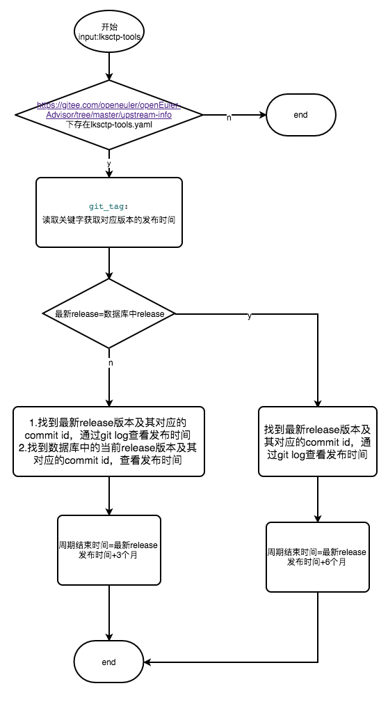
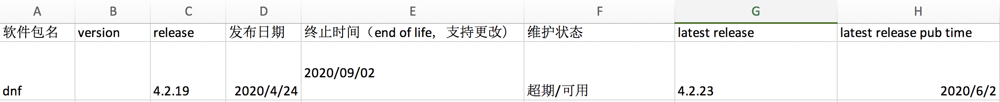
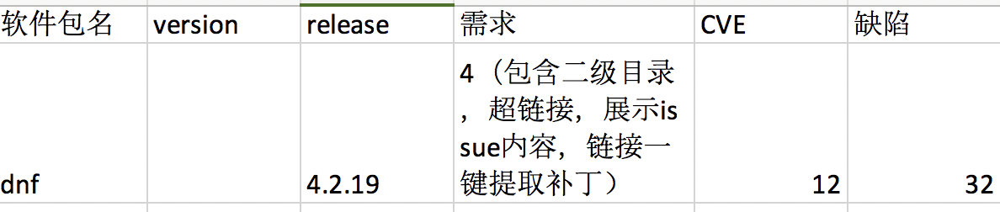

# pkgship 2.0 —— 生命周期 设计文档

## 特性描述

- SR-PKG-MANAGE02-AR01: 包静态信息建档管理
- SR-PKG-MANAGE02-AR02: 包动态信息跟踪（生命周期）
- SR-PKG-MANAGE01-AR11: 包补丁分类管理
- SR-PKG-MANAGE03-AR01: 特性与包关联模块
- SR-PKG-MANAGE01-AR12: 支持网页前端显示
- SR-PKG-MANAGE02-AR02:支持软件责任人及软件维护级别的存储和更改

## 依赖组件

- git, svn, pypi
- openEuler-Advisor/ upstream-info

## License

Mulan V2

## 流程分析

### 外部接口清单

| 序号 | 接口名称 | 类型 | 说明 | 特性号 | 涉及内部函数 |
|    - |   - |    - |   - |  - | - |
| 1 | /packages | GET | 支持查看所有软件包静态信息、对应特性、动态信息及issue数量统计信息 | all | - |
| 2 | /packages/tablecol | GET | 支持获取前端显示的列表信息名称 | MANAGE01-AR12 | - |
| 3 | /lifeCycle/tables | GET | 支持查看package-info数据库中所有表名 | MANAGE01-AR12 | - |
| 4 | /lifeCycle/maintainer | GET | 支持查看package-info数据库中指定表名内的所有maintainer | MANAGE02-AR02 |
| 5 | /lifeCycle/download/packages | GET | 支持下载package-info数据库中指定表名内的所有包信息 | MANAGE02-AR02 & SR-PKG-MANAGE02-AR01 |
| 6 | /lifeCycle/download/issues | GET | 支持下载package-info数据库中issue表中对应版本的所有信息 | MANAGE01-AR11 |
| 7 | /packages/packageInfo | GET | 支持查看指定软件包静态信息、对应特性、动态信息及issue数量统计信息以及一层依赖关系 | all | - |
| 8 | /lifeCycle/issueTrace | GET | 支持查看package-info数据库中issue表中对应版本的信息 | MANAGE01-AR11 | - |
| 9 | /lifeCycle/issueType | GET | 支持查看issue的类型 | MANAGE01-AR12 | - |
| 10 | /lifeCycle/issuStatus | GET | 支持查看issue的状态 | MANAGE01-AR12 | - |
| 11 | /lifeCycle/updatePkgInfo | PUT | 支持更新指定软件包信息字段 | MANAGE02-AR02 |  -  |
| 12 | /lifeCycle/importdata | POST | 批量更新或导入生命周期软件包 | MANAGE02-AR02 | - |
| 13 | /lifeCycle/issueCatch | PUT | 支持获取gietee上src_openEuler仓库中的新增issue信息 | MANAGE01-AR11 | - |

#### 1. 包关键信息获取接口

- API: /packages

- HTTP请求方式： GET

- 数据提交方式： application/json

- 请求参数：

  | 参数名 | 必选 | 类型 | 说明 |
  |    - |   - |    - |   - |
  | table_name | True | string | 数据库pkginfo下的表名，如：mainline, bringInRely|
  | page_num | True | int | 当前所在页数|
  | page_size | True | int | 每页显示的条数|
  | query_pkg_name | False | string | 源码包名，模糊匹配 |
  | maintainner | False | string | 维护人名称 |
  | maintainlevel | False | int | 软件包维护级别 |
  | maintain_status | False | string | 软件包维护状态 |

- 请求参数示例：

  ```json
  {
      "table_name" : "Mainline",
      "page_num": "1",
      "page_size": "2",
      "query_pkg_name" : "dnf",
      "maintainner": "ruebb",
      "maintainlevel": "4"
  }
  ```

- 返回体参数：

  | 参数名 | 类型 | 说明 |
  |    - |   - |    - |
  | total_count | int | 总条数 |
  | total_page | int | 总页数 |
  | id | int | |
  | name | string | 包名 |
  | version | string | 版本号 |
  | release | string | release号 |
  | url | string | url地址 |
  | rpm_license | string | license |
  | feature | string | 特性 |
  | maintainer | string | 维护人 |
  | maintainlevel | int | 软件包维护级别 |
  | release_time | string | 当前版本发布时间 |
  | used_time | string | 当天减去所用版本的发布日期 |
  | latest_version | string | 最新版本号 |
  | latest_version_time | string | 最新版本发布时间 |
  | issue | int | 该软件包仓库下的issue总数 |

- 返回体参数示例：

  ```json
  {
    "code": "200",
    "total_count": 10309,
    "total_page": 10,
    "data": [{
                  "id":1,
                  "name": "dnf",
                  "version": "3.0.1",
                  "release": "oe1.3",
                  "url": "www.gitee.com/src_openEuler/dnf",
                  "rpm_license":"Mulan" ,
                  "feature": "",
                  "maintainer": "ruebb",
                  "maintainlevel": "4",
                  "release_time":"2020-01-02",
                  "used_time":"180d",
                  "maintainer_status": "available",
                  "latest_version":"3.4.2",
                  "latest_version_time ":"2020--5-26",
                  "issue":"13"
              },
              {
                  "id":2,
                  "name": "",
                  "version": "",
                  "release": "",
                  "url":"",
                  "rpm_license":"" ,
                  "feature": "",
                  "maintainer": "",
                  "maintainlevel": "",
                  "release_time":"",
                  "end_of_lifecycle":"",
                  "maintainer_status":"",
                  "latest_version":"",
                  "latest_version_time ":"",
                  "issue":"14"
              }
            ],
    "msg": ""
  }
  ```

  | 状态码 | 场景 | 提示信息 |
  |    - |   - |    - |
  |    200 |   成功 |     |
  |    400 |   失败 |     |
  |    500 |   服务器内部错误 |     |

#### 2. 列表信息获取接口

- API:/packages/tablecol

- HTTP请求方式： GET

- 数据提交方式： application/json

- 请求参数：

  | 参数名 | 必选 | 类型 | 说明 |
  |    - |   - |    - |   - |
  | table_name | True | string | 数据库pkginfo下的表名，如：mainline, bringInRely|

- 请求参数示例：

  ```json
  {
      "table_name" : "Mainline"
  }
  ```

- 返回体参数：

  | 参数名 | 类型 | 说明 |
  |    - |   - |    - |
  | data | list | 包展示列信息列表 |
  | column_name | string | 列名 |
  | default_selected | boolean | 默认显示在列中 |

- 返回体参数示例：

  ```json
  {
    "code": "200",
    "data": [{
            "column_name": "name",
            "default_selected": true,
            "label": "Name"
        },
        {
            "column_name": "version",
            "default_selected": true,
            "label": "Version"
        },
        {
            "column_name": "release",
            "default_selected": true,
            "label": "Release"
        },
        {
            "column_name": "url",
            "default_selected": true,
            "label": "Url"
        },
        {
            "column_name": "rpm_license",
            "default_selected": false,
            "label": "License"
        },
        {
            "column_name": "feature",
            "default_selected": false,
            "label": "Feature"
        },
        {
            "column_name": "maintainer",
            "default_selected": true,
            "label": "Maintainer"
        },
        {
            "column_name": "maintainlevel",
            "default_selected": true,
            "label": "Maintenance Level"
        },
        {
            "column_name": "release_time",
            "default_selected": false,
            "label": "Release Time"
        },
        {
            "column_name": "used_time",
            "default_selected": true,
            "label": "Used Time"
        },
        {
            "column_name": "latest_version",
            "default_selected": false,
            "label": "Latest Version"
        },
        {
            "column_name": "latest_version_time",
            "default_selected": false,
            "label": "Latest Version Release Time"
        },
        {
            "column_name": "issue",
            "default_selected": true,
            "label": "Issue"
        }
    ],
    "msg": ""
  }
  ```

#### 3. 版本库列表获取接口

- API: /lifeCycle/tables

- HTTP请求方式： GET

- 数据提交方式： application/json

- 请求参数：null

- 返回体参数：

  | 参数名 | 类型 | 说明 |
  |    - |   - |    - |
  | data | list | 版本库名称列表 |

- 返回体参数示例：

  ```json
  {
    "code": "200",
    "data":["openEuler-20.03", "openEuler-20.09", "master"],
    "msg": ""
  }
  ```

#### 4.maintainer列表获取接口

- API:/lifeCycle/maintainer

- HTTP请求方式： GET

- 数据提交方式： application/json

- 请求参数：

  | 参数名 | 必选 | 类型 | 说明 |
  |    - |   - |    - |   - |
  | table_name | True | string | 数据库pkginfo下的表名，如：mainline, bringInRely|

- 请求参数示例：

  ```json
  {
      "table_name" : "Mainline"
  }
  ```

- 返回体参数：

  | 参数名 | 类型 | 说明 |
  |    - |   - |    - |
  | data | list | 维护人列表 |

- 返回体参数示例：

  ```json
  {
    "code": "200",
    "data":["ruebb", "jinjin", "solar-hu", "mayunbaba"]
  }
  ```

#### 5. 包所有信息Excel获取接口（待更新）

- API: /lifeCycle/download/packages

- HTTP请求方式： GET

- 数据提交方式： application/json

- 请求参数：

| 参数名 | 类型 | 说明 |
|   -    |  -  |   -  |
| table_name | str | 下载的版本库名称 |

- 返回体：二进制流（excel表格）

#### 6. 包所有issue Excel获取接口（待更新）

- API: /lifeCycle/download/issues

- HTTP请求方式： GET

- 数据提交方式： application/json

- 请求参数：null

- 返回体：二进制流（excel表格）

#### 7. 包详细信息获取接口

- API:/packages/packageInfo

- HTTP请求方式： GET

- 数据提交方式： application/json

- 请求参数：

  | 参数名 | 必选 | 类型 | 说明 |
  |    - |   - |    - |   - |
  | table_name | True | string | 数据库pkginfo下的表名，如：mainline, bringInRely|
  | pkg_name | True | string | 源码包名 |

- 请求参数示例：

  ```json
  {
      "table_name" : "Mainline",
      "pkg_name" : "dnf"
  }
  ```

- 返回体参数：

  | 参数名 | 类型 | 说明 |
  |    - |   - |    - |
  | pkg_name | string | 源码包包名 |
  | version | string | 版本号 |
  | release | string | release号 |
  | url | string | 上游社区链接 |
  | license | string | license |
  | feature | string | 特性 |
  | maintainer | string | 维护人 |
  | maintainlevel | int | 软件包维护级别 |
  | issue | int | issue数量 |
  | gitee_url | string | 软件包在码云的链接 |
  | summary | string | summary |
  | decription | string | description |
  | buildrequired | list | 源码包的编译依赖 |
  |     |    |     |
  | subpack | list | 源码包对应的二进制包列表 |
  | id | int | 二进制包id |
  | name | string | 二进制包名 |
  |     |    |     |
  | provides | list |二进制包提供的组件列表 |
  | id | int | 提供的组件id |
  | name | string | 提供的组件名称 |
  | requiredby | list | 依赖该组件的二进制包列表 |
  |     |    |     |
  | requires | list | 此二进制包依赖的组件列表 |
  | id | int | 依赖的组件id |
  | name | string | 依赖的组件名称 |
  | providedby | string | 提供该组件的二进制包 |

- 返回体参数示例：

  ```json
  {
    "code":200,
    "msg":"",
    "data":{
      "pkg_name": "dnf",
      "version":"3.0.2",
      "release":"oe.13",
      "url":"github.com",
      "license":"GLV",
      "feature":"rpm-management",
      "maintainer":"ruebb",
      "maintainlevel": 4,
      "gitee_url": "www.gitee.com/src_openEuler/dnf",
      "issue":12,
      "summary":"xxxxxxxxxxxxxxxxx",
      "description":"xxxxxxxxxx",
      "buildrequired":["gcc","make"],
      "subpack":[
        {
          "id":1,
          "name":"dnf",
          "provides":[
            {
              "id":1,
              "name":"dnf = 4.2.15-8.oe1",
              "requiredby":["yum","supermin","kiwi-systemdeps","dnf-plugins-core","mock"]
            }
          ],
          "requires":[
            {
              "id":1,
              "name":"libreport-filesystem",
              "providedby":"libreport"
              }
          ]
        }
      ]
    }
  }
  ```

#### 8. issue获取接口

- API: /lifeCycle/issueTrace

- HTTP请求方式： GET

- 数据提交方式： application/json

- 请求参数：

  | 参数名 | 必选 | 类型 | 说明 |
  |    - |   - |    - |   - |
  | table_name | True | string | 数据库pkginfo下的表名，如：mainline, bringInRely|
  | page_num | True | Int | 当前所在页数 |
  | page_size | True | Int | 每页显示条数 |
  | pkg_name | False | string | 源码包名 |
  | issue_type | False | string | issue 类型 |
  | issue_status | False | string | issue 状态 |
  | maintainer | False | string | 软件包负责人 |

  - 请求参数示例：

  ```json
  {
      "table_name" : "Mainline",
      "pkg_name" : "dnf",
      "page_num": "1",
      "page_size": "2"
  }
  ```

- 返回体参数：

  | 参数名 | 类型 | 说明 |
  |    - |   - |    - |
  | total_count | int | 总条数 |
  | total_page | int | 总页数 |
  | issue_id | int | issue id |
  | pkg_name | string | 包名 |
  | table_name | string |版本名称 |
  | issue_url | string | 码云issue链接 |
  | issue_title | string | issue 主题 |
  | issue_content | string | issue 内容 |
  | issue_status | string | issue 状态 |
  | issue_type | string | issue 类型 |
  | maintainer | string | 软件包维护人 |

- 返回体参数示例：

    ```json
    {
      "code":200,
      "msg":'',
      "data":[
        {
          "total_count": 10309,
          "total_page": 10,
          "issue_id": "I1PGWQ",
          "pkg_name": "PyYaml",
          "table_name": "Mainline",
          "issue_url": "https://gitee.com/openeuler/openEuler-Advisor/issues/I1PGWQ",
          "issue_title":"get_yaml 接口的返回值类型有str和bool，对上层调用判断不太友好，建议修",
          "issue_content":"def get_yaml(self, pkg): pass\n",
          "issue_status": "open",
          "issue_type": "demand",
          "maintainer": "ruebb"
        },
        {
          "issue_id": "I1OQW0",
          "pkg_name": "PyYaml",
          "table_name": "Mainline",
          "issue_url": "https://gitee.com/openeuler/openEuler-Advisor/issues/I1OQW0",
          "issue_title":"【CI加固】对识别修改对周边组件和升级影响，提交构建支持接口变更检查",
          "issue_content": "1.支持C/C++接口变更检查\n2.支持/etc下的配置文件变化检查\n\n检查结果以提示信息反馈给提交人",
          "issue_status": "open",
          "issue_type": "bug",
          "maintainer": "ruebb"
    
        },
        {
          "issue_id": "I1O6OE",
          "pkg_name": "PyYaml",
          "table_name": "Mainline",
          "issue_url": "https://gitee.com/openeuler/openEuler-Advisor/issues/I1O6OE",
          "issue_title": "【pkgship】数据库结构变化，包依赖查询的sql语句需要整改。同时需要考虑provides和requires在同一个数据库中不一一对应的情况。",
          "issue_content": "涉及到的包依赖查询逻辑有：\n1.包的安装依赖查询语句\n2.包的编译依赖查询语句\n3.包的被依赖查询语句\n4.包的信息查询语句",
          "issue_status": "closed",
          "issue_download": "",
          "issue_type": "CVE",
          "maintainer": "ruebb"
    
        }
      ]
    }
    ```

#### 9. issue type列表获取接口

- API: /lifeCycle/issueType

- HTTP请求方式： GET

- 数据提交方式： application/json

- 请求参数：null
- 请求参数示例：null

- 返回体参数：

  | 参数名 | 类型 | 说明 |
  |    - |   - |    - |
  | data | list | issue type列表 |

- 返回体参数示例：

  ```json
  {
    "code": "200",
    "data":["CVE", "demand", "bug"]
  }
  ```

#### 10. issue status列表获取接口

- API: /lifeCycle/issueType

- HTTP请求方式： GET

- 数据提交方式： application/json

- 请求参数：null
- 请求参数示例：null

- 返回体参数：

  | 参数名 | 类型 | 说明 |
  |    - |   - |    - |
  | data | list | issue status 列表 |

- 返回体参数示例：

  ```json
  {
    "code": "200",
    "data":["Closed", "Open", "In progress", "Rejected"]
  }
  ```

#### 11. 更新软件包信息接口

- API: /lifeCycle/updatePkgInfo

- HTTP请求方式： PUT

- 数据提交方式： application/json

- 请求参数：

  | 参数名 | 必选 | 类型 | 说明 |
  |    - |   - |    - |   - |
  | table_name | True | string | 数据库pkginfo下的表名，如：mainline, bringInRely|
  | pkg_name | False | string | 源码包名(当为单包更新时需要传递，批量更新时无需传递) |
  | maintainer | False | string | 软件包责任人 |
  | maintainlevel | False | string | 软件包维护级别 |
  | batch | True | boolean | true: 批量更新 false: 单个包更新 |
  | filepath | False | str | 批量更新时，存放yaml文件的文件夹路径 |

- 请求参数示例：

  ```json
  {
      "table_name" : "Mainline",
      "pkg_name" : "dnf",
      "end_of_life": "2020-08-26",
      "maintainer": "ruebb",
      "maintainlevel": 4,
      "batch": true,
      "filepath": "/etc/upstream-info/"
  }
  ```

#### 12. 导入包信息或批量更新包（弃用,合并到pkgship init 接口中）

- API: /lifeCycle/importdata

- HTTP请求方式：POST

- 数据提交方式：application/json

- 请求参数：

 | 参数名 | 必选 | 类型 | 说明 |
 |    - |   - |    - |   - |
 | dbpath | True | str | 导入的数据库文件路径 |
 | tablename | True | str | 版本库的名称（表名） |

 - conf.yaml 参数示例：

 ```yaml
  - dbname: bringInRely
  src_db_file: /etc/database/bringInRely_src.sqlite
  bin_db_file: /etc/database/bringInRely_bin.sqlite
  lifecycle: enable
  priority: 2
- dbname: fedora30
  src_db_file: /etc/database/fedora30_src.sqlite
  bin_db_file: /etc/database/fedora30_bin.sqlite
  lifecycle: disable
  priority: 3
- dbname: mainline
  src_db_file: /etc/database/mainline_src.sqlite
  bin_db_file: /etc/database/mainline_bin.sqlite
  lifecycle: enable
  priority: 1
- dbname: openEuler_LTS_20.03
  src_db_file: /etc/database/openEuler-src.sqlite
  bin_db_file: /etc/database/openEuler-bin.sqlite
  lifecycle: enable
  priority: 3
 ```

 #### 13. 获取新增issue接口

- API: /lifeCycle/IssueCatch

- HTTP请求方式：PUT

- 数据提交方式：application/json

- 请求参数：

 | 参数名 | 必选 | 类型 | 说明 |
 |    - |   - |    - |   - |
 | issue_id| True | str | Issue ID |
 | pkg_name| True | str | 包名称 |

 - 请求参数示例：

 ```json
 {
   "issue_id" : "I1PHSL",
   "pkg_name" : "units"
 }
 ```

- 返回体参数：
  | 状态码 | 场景 | 提示信息 |
  |    - |   - |    - |
  |    2001 |   成功 |     |
  |    4001 |   失败 |     |
  |    5001 |   服务器内部错误 |     |

### python内部函数接口清单

| 序号 | 接口名称 | 说明 | 入参 | 出参 |
|    - |   - |    - |   - |  - |
| 1 |  _blurry_pack_info| 获取满足条件的包关键信息 |   table_name,page_num,page_size,querypkg_name,maintainner,maintainlevel |  列表['{包1}'，'{包1}'] |
| 2 | _get_table_column | 获取table的列名 | table_name |  列表['列1','列2'] |
| 3 | _get_tables | 获取lifecycle数据库下tables的名字 | 无 | 列表['表名1','表名2'] |
| 4 | _get_maintainers | 获取lifecycle数据库下对应table内的maintainer列表 | table_name | 列表['维护人1','维护人2'] |
| 5 | _all_pack_info | 获取lifecycle数据库下对应table（版本库）内的所有包信息 |   table_name |  列表['{包1}'，'{包1}'] |
| 6 | _get_issue_contents | 获取lifecycle数据库下对应版本库的所有issue信息 |  table_name |  列表[{issue内容1},{issue内容2}] |
| 7 | _download_excel_content | 下载excel表格 | type | 文本二进制流 |
| 8 |  _sub_pack | 包的一层依赖关系信息获取 |   srcname,table_name |  列表['{子包1}'，'{子包2}'] |
| 9 | _get_specified_issue_content | 获取满足搜索条件的issue信息 | table_name，pkg_name，page_num |  列表[{issue内容1},{issue内容2}]  |
| 10 | _get_issue_type | 返回issue类型 |   - |  列表[issue type]  |
| 11 | _get_issue_status | 返回issue状态 |   - |  列表[issue status]  |

#### 外部接口请求、回显格式

*需和前台对齐回显格式

- *packages-info*:

  静态信息：name, version, release, url, rpm_license, feature, maintainer, maintainlevel;

  动态信息&动态信息统计：name, version,release, published time, end time, maintainer status, latest version, latest publish time

  动态信息统计：name, version,release, 需求， cve&安全问题， 缺陷
- *packages-info-detailed*: name, version, release, url, rpm_license, maintainer, maintainlevel, summary, description, required, subpack， subpack-provides, subpack-requires-component, subpack-requires-binary(if exist)
- *packages-issue*: list: issudId, issue-url, issue-content, issue-status, issue-download

## 功能设计

### 主体流程分析

计算生命周期结束日期：


### 数据表设计

针对不同的版本，设计多个字段相同，表名不同的table （注：表名应于对应依赖数据库名称相同）：

- Mainline

| 序号 | 名称 | 说明 | 类型 | 键 | 允许空 | 默认值 |
|    - |   - |    - |   - |  - | - | -  |
| 1 | id | 条目序号 | Int | Primary | NO | -  |
| 2 | name | 源码包名 | String | NO | YES | -  |
| 3 | url | URL | String | NO | YES | -  |
| 4 | rpm_license | license | String | NO | YES | -  |
| 5 | version | 版本号 | String | NO | YES | -  |
| 6 | release | release号 | String | NO | YES | -  |
| 7 | version_time | 当前版本发布时间 | String | NO | YES | -  |
| 8 | end_time | 结束当前版本生命周期的时间 | String | NO | YES | -  |
| 9 | maintainer_status | 生命周期状态 | String | NO | YES | "Available"  |
| 10 | latest_version | 最新版本号 | String | NO | YES | -  |
| 11 | latest_version_time | 最新版本发布时间 | String | NO | YES | -  |
| 12 | demand | 需求 | Int | NO | NO | 0  |
| 13 | cve | cve及安全漏洞 | Int | NO | NO | 0  |
| 14 | defect | 缺陷 | Int | NO | NO | 0  |
| 15 | maintainer | 维护人 | String | NO | YES | -  |
| 16 | maintainlevel | 维护级别 | Int| NO | YES | -  |
| 17 | feature | 对应特性 | String | NO | YES | -  |
| 18 | version_control | 版本控制（git，svn） | String | NO | YES | -  |
| 19 | src_repo | 上游社区repo源 | String | NO | YES | -  |
| 20 | tag_prefix | 版本标签 | String | NO | YES | -  |
| 21 | summary | rpm包的summary | String | NO | YES | -  |
| 22 | description | rpm包的description | String | NO | YES | -  |

回显简单事例：


生命周期终止时间定义：

1. 若最新版本和当前版本一致，生命周期终止时间为最新发布日期的6个月后；
2. 若最新版本高于当前版本，生命周期终止时间为最新发布日期的3个月后。



## 遗留问题
