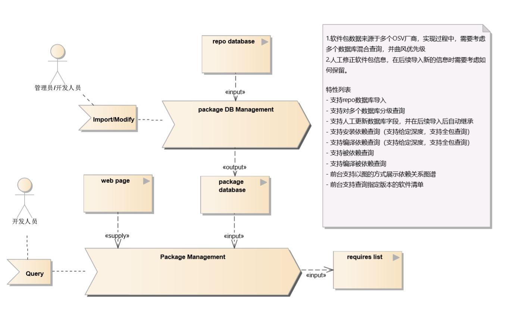
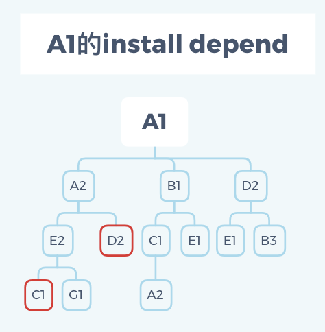
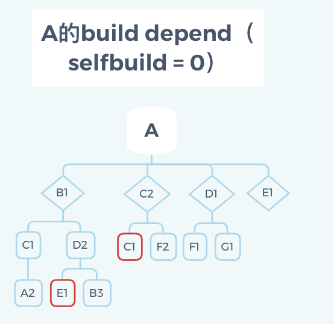
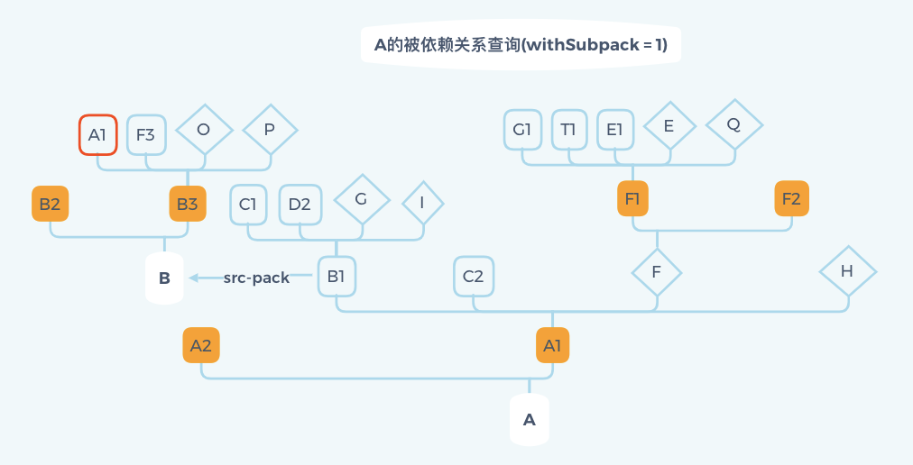

#特性描述
管理OS软件包依赖关系，提供依赖和被依赖关系的完整图谱查询功能，方便开发者识别软件包范围，减少依赖梳理复杂度。
##原始需求-软件包依赖管理
- 输入软件包A，支持查询A的所有编译依赖（新增软件包）
- 输入软件包A，支持查询A的所有安装依赖（新增软件包）
- 输入软件包A，支持查询所有安装依赖A的软件（升级，删除软件包场景）
- 输入软件包A，支持查询所有编译依赖A的软件（升级，删除软件包场景）

#依赖组件
- createrepo

#License
Mulan V2

#流程分析
##软件包依赖管理

###功能清单
- SR-PKG-MANAGE01-AR01:支持repo数据库导入 
- SR-PKG-MANAGE01-AR02:支持对多个数据库分级查询（内部接口） 
- SR-PKG-MANAGE01-AR03:支持软件包安装/编译依赖查询
- SR-PKG-MANAGE01-AR04:支持软件包自编译/自安装依赖查询
- SR-PKG-MANAGE01-AR05:支持被依赖查询
- SR-PKG-MANAGE01-AR06:支持编译被依赖查询
- SR-PKG-MANAGE01-AR07:支持前台查询和显示软件依赖关系
在线评审意见平台,支持查询评审意见及溯源

##外部接口清单

| 序号 | 接口名称 | 类型 | 说明 | 入参 | 出参 | 特性号 |
|    - |   - |    - |   - |  - | - | -  |
| 1 | /packages | GET |      支持查看所有软件包信息 | dbName | *packages* |   AR01 & AR02  |
| 2 | /packages | PUT |      支持更新指定软件包的信息 | *packages* |  null  |  AR01  |
| 3 | /packages/findByPackName | GET | 支持查询指定软件包的信息 | packageName,dbName,version(option) | *packages* |  AR01 & AR02  |
| 4 | /packages/findInstallDepend | POST | 支持查询指定软件包安装依赖(在一个或多个数据库中分级查询) | packageName,version(opetion),dbPreority | *response* |  AR02 & AR03  |
| 5 | /packages/findBuildDepend | POST | 支持查询指定软件包的编译依赖(在一个或多个数据库中分级查询) | packageName、version、repoPreority | *response* |  AR02 & AR03  |
| 6 | /packages/findSelfDepend | POST | 支持查询指定软件包的自安装/自编译依赖(在一个或多个数据库中分级查询) | packageName、version、repoPreority、withSubPack、withSelfBuild | packageName、installDepend、buildDepend、parentNode |  AR02 & AR04  |
| 7 | /packages/findBeDepend | POST | 支持在数据库中查询指定软件包的所有被依赖 | packageName、version、repoPreority、withSubPack | packageName、installBeDepend、buildBeDepend、parentNode |  AR05  |
| 8 | /repodatas | GET | 支持获取所有引入的版本库 | null | *Repodatas  |  AR01  |
| 9 | /repodatas | POST | 支持repo数据库的导入 | dbName、dbPath、priority、dbStatus、repofiles  | null |  AR01  |
| 10 | /repodatas | PUT | 支持版本库的更新 | dbName、dbPath、priority、dbStatus  | null |  AR01  |

###python函数接口清单

| 序号 | 接口名称 | 说明 | 入参 | 出参 |
|    - |   - |    - |   - |  - |
| 1 | get_packages | 支持查看所有软件包信息 | dbName | *packages* |
| 2 | update_package | 支持更新指定软件包信息 | *package* | null |
| 3 | query_package | 支持查询指定软件包的信息 | source_name,dbname,version(option) | *package* |
| 4 | query_install_depend | 支持查询指定软件包安装依赖(在一个或多个数据库中分级查询) | binary_name,version(option), db_preority | *response* |
| 5 | query_build_depend | 支持查询指定软件包的编译依赖(在一个或多个数据库中分级查询) | source_name,version(option),db_preority,selfbuild=1/0 | *response* |
| 6 | query_subpack | 支持查询指定源码包的子包 | srouce_name,version(option),db_preority | *subpack_list* |
| 7 | query_srcpack | 支持查询指定二进制包的源码包 | binary_name,version(option),dbname | srouce_name |
| 6 | query_self_depend | 支持查询指定软件包的自安装/自编译依赖(在一个或多个数据库中分级查询) | package_name,version(option),db_preority,withsubpack(default:0),withselfbuild(default:0) | *response* |
| 7 | query_self_be_depend | 支持在数据库中查询指定源码包的所有被依赖(在一个或多个数据库中分级查询) | source_name,version(option),db_preority,withsubpack(default:0) | *response* |
| 8 | get_db | 支持获取所有引入的版本库 | null | *dbinfo* |
| 9 | import_db | 支持repo数据库的导入 | *dbinfo* | null |
| 10 | update_db | 支持版本库的更新 | *dbinfo*  | null |

###外部config文件输入格式清单
1.初始化配置文件（init_db.config）
```
#dbname - 数据库名称，unique，不可重复
# src_db_file - 包含源码包信息的sqlite 文件
# bin_db_file - 包含二进制包信息的sqlite 文件
# status - 数据库状态，enable表示可用，disable表示不可用
# priority - 1~100 default priority for user to query the information in databases

- dbname: openEuler-20.03-LTS
  src_db_file: /etc/pkgmng/dbname/primary_src.sqlite
  bin_db_file: /etc/pkgmng/dbname/primary_binary.sqlite
  status: enable
  priority: 1

- dbname: openEuler-20.04-LTS
  src_db_file: testdb/src
  bin_db_file: testdb/bin
  status: enable
  priority: 2

- dbname: openEuler-20.05-LTS
  src_db_file: testdb/src
  bin_db_file: testdb/bin
  status: enable
  priority: 3
```
2.更新数据库信息（update_db.config）
```
- dbname: openEuler-20.03-LTS
  changeDBname: openEuler-LTS
  addDBFile: /etc/pkgmng/dbname/primary1.sqlite
  removeDBFile: /etc/pkgmng/dbname/primary2.sqlite
  status: disable
  priority: 4
```

3.更新包的信息（package.config）
```
#level: 维护的优先级，1-4
- dbname: openEuler-20.03-LTS
  packageName: openssh
  version: 2.99
  maintainer: solar-hu
  level: 3
```
###object
```
<package>
	<name>openssh</name>
	<version>1.3.2</version>
        <release>2-66</release>
	<license>GLv2</license>
	<maintainer>solar-hu</maintainer>
	<sourceURL>http://linuxcontainers.org</sourceURL>
	<downloadURL>lxc-4.0.1.tar.gz</downloadURL>
	<dbName>openEuler-20.03-LTS</dbName>
	<buildDep>
		<buildpackagename>zip-devel</buildpackagename>
		<buildpackagename>libmediaart-devel</buildpackagename>
	</buildDep>
	<subpack>
		<packageBinName>openssh-devel</packageBinName>
			<installDep>
				<installpackagename>maven-public</installpackagename>
				<installpackagename>tomcat</installpackagename>
			</installDep>
		<packageBinName>openssh-static</packageBinName>
		<packageBinName>openssh-help</packageBinName>
	</subpack>
</package>
```

```
<Repodatas>
	<DBname>openEuler</DBname>
	<priority>4</priority>
	<status>enable</status>
<Repodatas>
```

#数据表设计
- src-pack

| 序号 | 名称 | 说明 | 类型 | 键 | 允许空 | 默认值 |
|    - |   - |    - |   - |  - | - | -  |
| 1 | id | 源码包条目序号 | Int | Primary | NO | -  |
| 2 | name | 源码包包名 | String |  | NO | -  |
| 3 | version | 版本号 | String |  | NO | -  |
| 4 | license | 证书 | String |  | NO | -  |
| 5 | sourceURL | 源码包获取地址 | String |  | YES | -  |
| 6 | downloadURL | 下载地址获取 | String |  | YES | -  |
| 7 | Maintaniner | 维护责任人 | String |  | YES | -  |
| 8 | MaintainLevel | 维护优先级 | String |  | YES | -  |

- bin-pack

| 序号 | 名称 | 说明 | 类型 | 键 | 允许空 | 默认值 |
|    - |   - |    - |   - |  - | - | -  |
| 1 | id | 二进制包条目序号 | Int | Primary | NO | -  |
| 2 | name | 二进制包包名 | String |  | NO | -  |
| 3 | version | 版本号 | String |  | NO | -  |
| 4 | srcIDkey | 源码包包名ID | Int | foreignkey | NO | -  |

- pack-requires

| 序号 | 名称 | 说明 | 类型 | 键 | 允许空 | 默认值 |
|    - |   - |    - |   - |  - | - | -  |
| 1 | id | 依赖组件条目序号 | Int | Primary | NO | -  |
| 2 | name | 依赖组件名 | String |  | NO | -  |
| 3 | depProIDkey | 依赖组件对应的ID | Int | foreignkey | NO | -  |
| 4 | srcIDkey | 若为源码包该值不为空，列出来的是编译依赖 | Int | foreignkey | YES | -  |
| 5 | binIDkey | 若为安装包该值不为空，列出来的是安装依赖 | Int | foreignkey | YES | -  |

- pack-provides

| 序号 | 名称 | 说明 | 类型 | 键 | 允许空 | 默认值 |
|    - |   - |    - |   - |  - | - | -  |
| 1 | id | 组件条目序号 | Int | Primary | NO | -  |
| 2 | name | 组件名 | Int | Primary | NO | -  |
| 3 | binIDkey | 提供组件的二进制包ID | Int | foreignkey | NO | -  |


- repoCheckSame

| 序号 | 名称 | 说明 | 类型 | 键 | 允许空 | 默认值 |
|    - |   - |    - |   - |  - | - | -  |
| 1 | id | repoFile条目序号 | Int | Primary | NO | -  |
| 2 | name | repoFile名称 | String | | NO | -  |
| 3 | md5sum | md5sum指 | String | | NO | -  |


#功能设计
##主体流程分析


##依赖关系梳理
findInstallDepend:

findBuildDepend:

findBeDepend(withSubPack = 0):
删除源码包A造成的影响：
1.影响他的子包（A1,A2)
2.安装依赖A1,A2的二进制包
3.编译依赖A1,A2的源码包

findBeDepend(withSubPack = 1):
删除源码包A造成的影响：
1.影响他的子包（A1,A2)
2.安装依赖A1,A2的二进制包（B1)
3.编译依赖A1,A2的源码包
4.删除B1的源码包B,影响B的其他子包B2,B3


#遗留问题
- repo数据库分析，如何做数据组织    汪奕如
- 嵌套依赖查询流程整理              汪奕如
- svn/git监控原型验证              陈燕潘
- gitee机机接口对齐                陈燕潘
- 版本升级如何更新到补丁获取系统中   陈燕潘
- web前台拓扑图UCD设计             NA
- 数据表设计                       汪奕如
