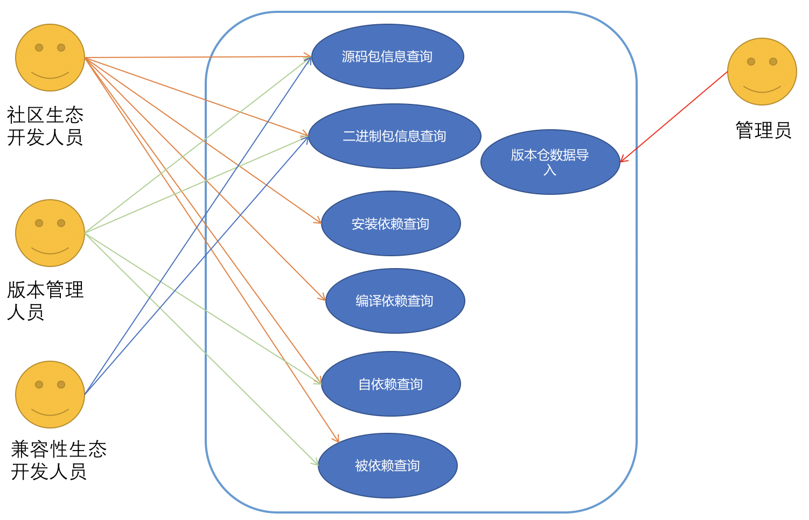
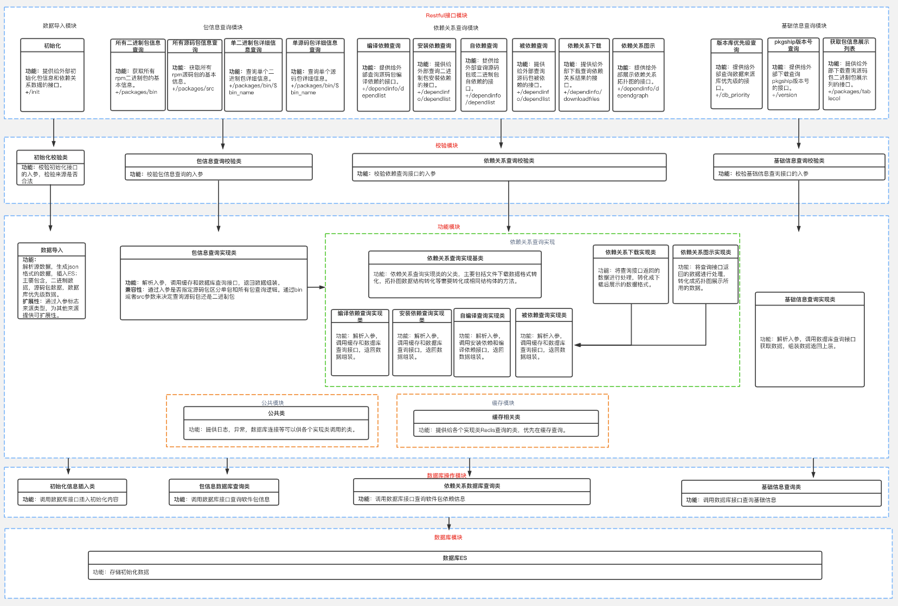
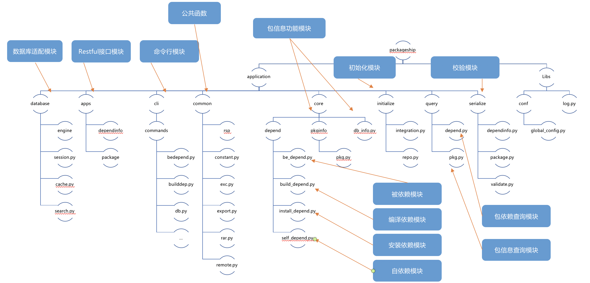
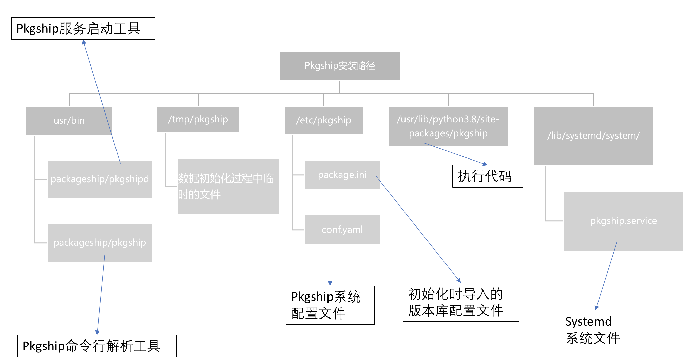

# pkgship 开发设计文档

## 1、 需求描述

1. 管理OS软件包信息，提供软件包版本号、license、源码地址以及文件列表等信息，方便开发者识别软件包区别，增加软件包兼容性
2. 管理OS软件包依赖关系，提供依赖和被依赖关系的完整图谱查询功能，方便开发者识别软件包范围，减少依赖梳理复杂度

### 1.1、 受益人

|角色|角色描述|
|:--|:-------|
| 软件生态扩展人员 | 维护开源社区软件生态的人员，在针对软件包引入、升级、删除的情况使用pkgship去排查软件包依赖情况 |
| 版本经理 | 负责版本发布、维护和进度看护的人员，在评估引入或者删除、升级某个软件包的时候，能基于pkgship给出的影响范围作为决策依据 |
| 软件兼容性生态维护人员 | 维护开源社区软件兼容性生态的人员，需要保证相同软件包在不同系统上能正常运行 |
| 测试人员 | 负责开源社区软件测试、版本测试的人员 |
| 维护人员 | 负责维护已发布版本的人员 |

### 1.2、 依赖组件

|组件|组件描述|可获得性|
|:--|:-------|:------|
| python3                        | python开发的软件，需要在python3的环境中运行         |                  |
| python3-flask                  | 提供web访问的http协议的框架                         |                  |
| python3-flask-restful          | 基于flask框架，封装了restful风格的API接口           |                  |
| python3-pyyaml                 | 读取yaml格式的配置文件                              |                  |
| python3-redis                  | 提供链接redis的驱动                                 |                  |
| python3-prettytable            | 命令行输出的美化后的表格                            |                  |
| python3-requests               | 发送http请求的类库                                  |                  |
| python3-concurrent-log-handler | logging日志辅助模块，解决多个日志记录是不全面的问题 |                  |
| python3-marshmallow            | 数据序列化验证的类库                                |                  |
| python3-uWSGI                  | 提供wsgi协议的服务器，用于软件发布后的部署          |                  |
| elasticsearch                  | elasticsearch数据库的API                            | （待引入进版本） |

### 1.3、 License

Mulan V2

## 2、 设计概述

### 2.1、 设计原则

- 数据与代码分离： 功能实现是需要考虑哪些数据是需要配置动态改变的，不可在代码中将数据写死，应提取出来做成可配置项。

- 分层原则： 上层业务模块的数据查询应通过查询模块调用数据库获取数据，不可直接跨层访问数据库。

- 接口与实现分离：外部依赖模块接口而不是依赖模块实现。

- 模块划分： 模块之间只能单向调用，不能存在循环依赖。

- 变更： 架构设计变更、外部接口变更、特性需求变更需要结合开发、测试等所有相关人员经过开会讨论后决策，不可擅自变更。

## 3、 需求分析

### 3.1、 USE-CASE视图



主要外部人员为管理员和开发、版本管理人员。只有管理员对系统有写入操作，其他人员只需要读取数据查询结果即可。社区生态开发人员更关注依赖查询的详细数据，管理人员更注重数据结果，负责兼容性生态的开发人员更注重软件包的信息

### 3.2、 逻辑视图



- restful模块： 对外接口模块，对前台的请求进行处理
- 校验模块： 对对外传入参数（包括前台和命令行）进行合法性检验
- 初始化模块： 对服务进行初始化，包括配置文件的读取，版本库数据导入至数据库
- 包信息模块： 功能模块，实现包信息查询及数据结构的组装
- 依赖模块： 功能模块，实现包依赖查询及不同数据结构的组装
- 包依赖查询模块： 数据库操作模块，用于数据库的连接及读取数据库包依赖数据
- 包信息查询模块： 数据库操作模块，用于数据库的连接及读取数据库包信息数据
- redis缓存模块： 数据库操作模块，实现redis数据库的连接以及查询redia内数据

### 3.3、 开发视图



### 3.4、 部署视图

#### 3.4.1、文件部署视图



#### 3.4.2、 服务部署视图


### 3.5、 质量属性设计

#### 3.5.1、 软硬件配置

| 配置项        | 推荐规格                                   |
| ------------- | ------------------------------------------ |
| CPU           | 8核                                        |
| 内存          | 32G                                        |
| 网络带宽      | 300M                                       |
| I/O           | 375MB/sec                                  |
| Elasticsearch | 版本7.10.1；单机部署可用；有能力可部署集群 |
| Redis         | 建议大小配置为内存的3/4                    |

#### 3.5.2、 性能规格

|规格名称|规格指标|
|:--|:-------|
|内存占用| 初始化阶段，五万包占用内存1600M，平均每个包占用32k；运行阶段：小于等于700M。 |
|启动时间| 初始化两个数据库（openEuler-20.09和fedora30，15万个包左右），启动时间为：7min。 |
|响应时间| 3个数据库，90%的查询在5s内给出结果。 |
|文件规格| 初始化和下载功能需要创建临时文件，两个数据库不超过1G，用完即删。 |
|日志规格| 每日日志压缩转储，保留一个月日志，大小视业务操作频率而定。 |

#### 3.5.3、 系统可靠性设计

1. **数据库**：

    持久化：系统增加定时任务，在特定的时间段内，对系统中的数据做备份，保留最新或最近的数据，便于后期恢复 。

    redis淘汰机制： 从设置了过期时间（20分钟）的数据集中挑选最近最少使用的数据淘汰，淘汰算法的控制由redis内部实现 。

    重新初始化后与redis的同步机制：每次初始化时清空redis，下次查询操作再重新写入redis，保证数据一致性。

2. **异常情况**：

  使用systemctl机制实现进程异常终止后，服务自启动；

  容器挂掉，可以使用k8s自动重启。

3. **数据库部署：**

    建议和软件部署到同一节点或者相同网段，减少网络延迟。

    目前已满足单机运行诉求，es数据库支持主从节点的配置，数据库可以使用分布式搭建，以主节点的形式进行连接。

4. **多请求并发场景处理方**：

    增加redis缓存处理，减少服务器查询带来的计算型压力；

    初始化操作进行唯一性限制，同一时间只有第一个操作可以成功，后面操作均报错。

    增加截流、限流机制，在请求之前控制，同一个ip，同接口，60s内请求次数不得超过20次。

#### 3.5.4、 安全性设计

1. **数据库连接**：
    由于使用的是公开数据，所以用于本软件的数据库为无密码连接方式，通过网段进行数据库连接限制；

  如果用户已有使用密码登陆的数据库，需要再次安装一个无密码数据库供该软件使用。

  安装pkgship时，提供es自动化安装部署脚本。

2. **数据库容错**：

    每次初始化都会删除已有的数据，然后重新创建。保证每次初始化成功后都是完整数据。

3. **读写问题**：
    查询操作（读服务）所有用户均可操作，初始化操作（写服务）必须有软件管理员用户（安装时创建）或者root用户操作，代码中进行限制。

4. **权限问题**：

    采用权限最小化策略，主要文件权限如下：

    | 路径                                          | 属主                    | 权限 | 描述                             | 权限说明                                                     |
    | --------------------------------------------- | ----------------------- | ---- | -------------------------------- | ------------------------------------------------------------ |
    | /usr/bin/pkgship                              | pkgshipuser pkgshipuser | 755  | 命令行执行                       | 使用场景为所有用户都可以使用命令行执行查询操作，所以设置权限为755。初始化操作通过代码中判断当前登录用户是否为root或者pkgshipuser进行权限控制。 |
    | /usr/bin/pkgshipd                             | pkgshipuser pkgshipuser | 755  | 命令行执行                       | 启停服务脚本，脚本中限制只有pkgshipuser用户可以执行。        |
    | /opt/pkgship/tmp                              | pkgshipuser pkgshipuser | 750  | 初始化的临时数据存放文件夹       | pkgshipuser需要写入。                                        |
    | /etc/pkgship/package.ini                      | pkgshipuser pkgshipuser | 640  | pkgship配置文件                  | pkgshipuser需要写入，其他用户无法读取。                      |
    | /etc/pkgship/conf.yaml                        | pkgshipuser pkgshipuser | 644  | 初始化时数据来源配置文件         | pkgshipuser需要写入，其他用户可查看当前配置的数据源。        |
    | /usr/lib/python3.8/site-packages/pkgship      | pkgshipuser pkgshipuser | 755  | pkgship源码                      | 普通用户执行命令时需要读取。                                 |
    | /lib/systemd/system/pkgship.service           | pkgshipuser pkgshipuser | 640  | system系统文件                   | systemctl启停时，pkgshipuser用户需要读取。                   |
    | /var/log/pkgship                              | pkgshipuser pkgshipuser | 755  | 业务日志路径                     | 普通用户可以查看业务日志。                                   |
    | /var/log/pkgship-operation                    | pkgshipuser pkgshipuser | 700  | 操作日志路径                     | 操作日志含有敏感信息，只有pkgshipuser用户可以查看。          |
    | /etc/pkgship/auto_install_pkgship_requires.sh | root root               | 750  | elasticsearch和redis自动安装脚本 | 涉及rpm包安装，只有root用户可执行。                          |
    | /etc/pkgship/uwsgi_logrotate.sh               | pkgshipuser pkgshipuser | 750  | 操作日志转储任务脚本             | pkgshipuser在启动时执行。                                    |

5. **启动问题：**

    systemctl start pkgship.service只能由root用户启动

    pkgshipd start 可以只能由pkgshipuser用户启动

6. 命令注入问题：

    命令行操作，入参会做校验，而且后台为解析参数后调用url接口，不存在入参拼接命令执行操作，所以不存在命令注入问题。

#### 3.5.5、 兼容性设计

对外接口只能增量变化，新版本保证旧版本接口可用。

对于底层缓存，数据库的变更，对外不体现，由代码逻辑保证可用性。

#### 3.5.5、 可服务性设计

#### 3.5.6、 可测试性设计

### 3.6、 特性清单

#### 3.6.1 原始需求

1. 以源码包为纬度，查看所有源码包基本信息
2. 以二进制包为纬度，查看所有二进制包基本信息
3. 输入一个源码包A，支持在多个版本库间查询A的详细信息及编译依赖以及A包的子包的一层安装依赖和被依赖
4. 输入一个二进制包A1，支持在多个版本库间查询A1的详细信息及一层安装依赖和被依赖以及文件信息
5. 输入一个（多个）二进制包A1，支持在多个版本库间查看A1的安装依赖
6. 输入一个（多个）源码包A，支持在多个版本库间查看A的编译依赖
7. 输入一个（多个）源码（二进制）包A，支持在多个版本库间查看A的自依赖
8. 输入一个（多个）源码（二进制）包A，支持在多个版本库间查看A的被依赖

> 自依赖：自依赖模拟软件包引入场景，会根据不同诉求，查询某软件包A的安装、编译依赖（B, C, D），以及B,C,D的安装、编译依赖  
> 被依赖：被依赖模拟软件包更新、删除场景，会根据不同诉求，查询软件包A被哪些二进制或者源码包安装、编译依赖（E,F,G）,以及E,F,G被哪些包安装、编译依赖

|no|特性描述|代码估计规模|实现版本|
|:--|:-------|:------|:----|
| 1 | 获取默认的版本库排序 | 0.3k | |
| 2 | 获取pkgship的 version 和 release 号 | 0.3k | |
| 3 | 服务初始化，包含数据库导入conf.yaml中配置的本地和远程repo源中的sqlite文件（不支持repo源中无sqlite文件的导入，不支持sqlite文件导入），pkgship配置文件读取解析的操作 | 1.5k | |
| 4 | 获取所有rpm源码包的基本信息（源码包名称、源码包版本号、源码包所在的版本仓、源码包license和源码包的url地址） | 0.5k | |
| 5 | 获取所有rpm二进制包的基本信息（二进制包名称、二进制包版本号、二进制包所在的版本仓、二进制包license、二进制包的url地址和二进制包的源码名） | 0.5k | |
| 6 | 查询单个源码包详细信息（源码包名、 源码包版本号、license、url、summary、description、源码包的编译依赖包列表、源码包提供的二进制包、以及源码包提供的二进制包提供的组件名和依赖的组件名、以及提供的组件名[provides]被哪些二进制包安装依赖[install required by]和被哪些源码包编译依赖[build requied by]，依赖的组件名[requires]被哪些二进制包提供[privided by]） | 0.8k | |
| 7 | 查询单个二进制包详细信息（二进制包名、 二进制包版本号、license、url、summary、description、二进制包的源码包名、二进制包提供的文件名列表[filelist]、二进制包提供的组件名和依赖的组件名、以及提供的组件名[provides]被哪些二进制包安装依赖[install required by]和被哪些源码包编译依赖[build requied by]，依赖的组件名[requires]被哪些二进制包提供[privided by]） | 0.8k | |
| 8 | 输入一个（或多个）二进制rpm包名，返回该rpm包的全量（或指定层数）的依赖（安装、编译、自依赖、被依赖）列表 | 3.5k | |
| 9 | 获取包含详细依赖关系的压缩文件，可提供安装、编译、自依赖和被依赖关系的文件下载 | 1.5k | |
| 10 | 点击列表中的二进制（源码）rpm包名，获取包含上下两层（共四层）详细依赖关系的图谱，可提供安装、编译、自依赖和被依赖关系的图谱展示 | 1.5k | |
| 11 | 使用systemctl控制pkgship服务的开启和关闭，实现服务挂掉自动拉起，且启动程序时，建立一个服务管理员用户。 | 0.1k | |
总：11.2k

### 3.7、 外部接口清单

#### 3.7.1、 restful接口清单

| 序号 | 接口名称 | 类型 | 说明 | 特性号 |
|    - |   - |    - |   - |  - |
| 1 | /db_priority | GET | 获取默认的版本库排序 | 1 |
| 2 | /version | GET | 获取pkgship的version号| 2 |
| 3 | /init（删除） | POST | 服务初始化，包含数据库导入conf.yaml中配置的本地和远程repo源中的sqlite文件（不支持repo源中无sqlite文件的导入，不支持sqlite文件导入），pkgship配置文件读取解析的操作| 3 |
| 4 | /packages/src | GET |  获取所有rpm源码包的基本信息（源码包名称、源码包版本号、源码包所在的版本仓、源码包license和源码包的url地址） | 4 |
| 5 | /packages/bin | GET |   获取所有rpm二进制包的基本信息（二进制包名称、二进制包版本号、二进制包所在的版本仓、二进制包license、二进制包的url地址和二进制包的源码名） | 5 |
| 6 | /packages/src/$src_name | GET | 查询单个源码包详细信息（源码包名、 源码包版本号、license、url、summary、description、源码包的编译依赖包列表、源码包提供的二进制包、以及源码包提供的二进制包提供的组件名和依赖的组件名、以及提供的组件名[provides]被哪些二进制包安装依赖[install required by]和被哪些源码包编译依赖[build requied by]，依赖的组件名[requires]被哪些二进制包提供[privided by]） | 6 |
| 7 | /packages/bin/$bin_name | GET | 查询单个二进制包详细信息（二进制包名、 二进制包版本号、license、url、summary、description、二进制包的源码包名、二进制包提供的文件名列表[filelist]、二进制包提供的组件名和依赖的组件名、以及提供的组件名[provides]被哪些二进制包安装依赖[install required by]和被哪些源码包编译依赖[build requied by]，依赖的组件名[requires]被哪些二进制包提供[privided by]） | 7 |
| 8 | /dependinfo/dependlist | POST | 获取安装、编译、自依赖和被依赖查询结果的列表 |  8 |
| 9 | /dependinfo/downloadfiles | POST | 获取包含详细依赖关系的压缩文件 | 9 |
| 10 | /dependinfo/dependgraph | POST | 获取包含上下两层（共四层）详细依赖关系的图谱 |  10 |
| 11 | /packages/tablecol | GET | 获列所有rpm源码包（二进制包）的基本信息页面展示列表信息获取接口 |  4、5 |

##### 3.7.1.1、 /db_priority

- 描述: 获取默认的版本库优先级排序

- HTTP请求方式：GET

- 数据提交方式：application/json

- 请求参数：null

- 返回体参数

  | 参数名 | 类型 | 说明 |
  |    - |   - |    - |
  | code | str | 状态码 |
  | reps  |  list|   软件包数据库列表 |
  | msg | str | 状态码对应的信息 |

- 返回体参数示例

```json
{
    "code": "200",
    "resp":["database2", "database3", "database4"],
    "msg": ""
}
```

##### 3.7.1.2、 /version

- 描述: 获取pkgship的版本号

- HTTP请求方式：GET

- 数据提交方式：application/json

- 请求参数：null

- 返回体参数

  | 参数名 | 类型 | 说明 |
  |    - |   - |    - |
  | code | str | 状态码 |
  | version  |  str|   版本号 |
  | release  |  str|   release号 |
  | msg | str | 状态码对应的信息 |

- 返回体参数示例

```json
{
    "code": "200",
    "version":"1.0",
    "release":"13",
    "msg": ""
}
```

##### 3.7.1.3、 /init

该版本不支持前台初始化请求

##### 3.7.1.4、 /packages/src

- 描述: 获取所有rpm源码包的基本信息

- HTTP请求方式： GET

- 数据提交方式： application/json

- 请求参数：

  | 参数名 | 必选 | 类型 | 说明 |
  |    - |   - |    - |   - |
  | database_name | True | string | 数据库pkginfo下的表名，如：mainline, bringInRely|
  | page_num | True | int | 当前所在页数|
  | page_size | True | int | 每页显示的条数|
  | query_pkg_name | False | string | 源码包名，精确匹配 |
  | command_line | bool | string | 确定请求url是否来自命令行 |

- 请求参数示例：

  ```json
  {
      "database_name" : "Mainline",
      "page_num": "1",
      "page_size": "2",
      "query_pkg_name" : "dnf",
      "command_line ": "False"
  }
  ```

- 返回体参数：

  | 参数名 | 类型 | 说明 |
  |    - |   - |    - |
  | code | str | 状态码 |
  | total_count | int | 总条数 |
  | total_page | int | 总页数 |
  | -resp | list | 包含源码包基本信息的列表 |
  | msg | str | 状态码对应的信息 |

  - resp 参数：

    | 参数名 | 类型 | 说明 |
    |    - |    - |   - |
    | -pkg_name | -str | -rpm name |
    | -license | -str | -rpm license |
    | -version | -str | -rpm version |
    | -url | -str | -rpm url |
    | database | -str | 所在版本仓的名字 |

- 返回示例：

  ```json
  {
    "code": "200",
    "total_count": 10309,
    "total_page": 10,
    "resp": [
      {
        "pkg_name": "Judy",
        "license": "Apache 2.0",
        "version": "2.0.0",
        "url":"http://www.xxx.com",
        "database": "Mainline"
      },
      ....
    ],
    "msg": ""
  }
  ```

  | 状态码 | 场景 | 提示信息 |
  |    - |   - |    - |
  |    200 |   成功 |  msg:   |
  |    400 |   失败 |   msg:  |
  |    500 |   服务器内部错误 |   msg:  |
  | ...| ...|...|

##### 3.7.1.5、 /packages/bin

- 描述: 获取所有rpm二进制包的基本信息

- HTTP请求方式： GET

- 数据提交方式： application/json

- 请求参数：

  | 参数名 | 必选 | 类型 | 说明 |
  |    - |   - |    - |   - |
  | database_name | True | string | 版本库名，如：mainline, bringInRely|
  | page_num | True | int | 当前所在页数|
  | page_size | True | int | 每页显示的条数|
  | query_pkg_name | False | string | 二进制包名，精确匹配 |
  | command_line | bool | string | 确定请求url是否来自命令行 |

- 请求参数示例：

  ```json
  {
      "database_name" : "Mainline",
      "page_num": "1",
      "page_size": "2",
      "query_pkg_name" : "dnf",
      "command_line ": "False"
  }
  ```

- 返回体参数：

  | 参数名 | 类型 | 说明 |
  |    - |   - |    - |
  | code | str | 状态码 |
  | total_count | int | 总条数 |
  | total_page | int | 总页数 |
  | -resp | list | 包含二进制包基本信息的列表 |
  | msg | str | 状态码对应的信息 |

  - resp 参数：

    | 参数名 | 类型 | 说明 |
    |    - |    - |   - |
    | -pkg_name | -str | -rpm name |
    | -license | -str | -rpm license |
    | -version | -str | -rpm version |
    | -url | -str | -rpm url |
    | -source_name | -str | -rpm 包的源码包 |
    | database | -str | 所在版本仓的名字 |

- 返回示例：

  ```json
  {
    "code": "200",
    "total_count": 10309,
    "total_page": 10,
    "resp": [
      {
        "pkg_name": "Judy",
        "license": "Apache 2.0",
        "version": "2.0.0",
        "url":"http://www.xxx.com",
        "source_name": "Judy",
        "database": "Mainline"
      },
      ....
    ],
    "msg": ""
  }
  ```

  | 状态码 | 场景 | 提示信息 |
  |    - |   - |    - |
  |    200 |   成功 |  msg:   |
  |    400 |   失败 |   msg:  |
  |    500 |   服务器内部错误 |   msg:  |
  | ...| ...|...|

##### 3.7.1.6、 /packages/src/$src_name

- 描述: 查询单个源码包详细信息

- HTTP请求方式： GET

- 数据提交方式： application/json

- 请求参数：

  | 参数名 | 必选 | 类型 | 说明 |
  |    - |   - |    - |   - |
  | database_name | True | string | 数据库pkginfo下的表名，如：mainline, bringInRely|
  | pkg_name | True | string | 源码包名 |

- 请求参数示例：

  ```json
  {
      "database_name" : "Mainline",
      "pkg_name" : "dnf"
  }
  ```

- 返回体参数：

  | 参数名 | 类型 | 说明 |
  |    - |   - |    - |
  | code | str | 状态码 |
  | resp | dict | 包含源码包详细信息的字典 |
  | msg | str | 状态码对应的信息 |

  - source_dict参数：

    | 参数名 | 类型 | 说明 |
    |    - |    - |   - |
    | pkg_name | str | -源码包名 |
    | license | str | -源码包license |
    | version | str | -源码包version |
    | url | str | -源码包的url地址 |
    | summary | str | 源码包概述 |
    | description | str | 源码包描述信息 |
    | buildrequired | List | -源码包的编译依赖 |
    | -subpack | list(dict) | -源码包所提供所有二进制包以及各自的安装依赖列表|

    - subpack

      | 参数名       | 类型  | 说明  |
      | ------------ | ----- | ----- |
      | bin_name    | -str  | subpacks rpm包的名字         |
      | -provides | -List(dict) | -sub_pack提供的组件列表 |
      | -requires | -List(dict) | -sub_pack依赖的组件列表 |

    _-provides和-requires的数据结构参考binpackageinfo中的_

- 返回示例：

  ```json
  {
    "code":200,
    "msg":"",
    "resp": {
      "openEuler:20.09":[
          {
            "pkg_name": "Judy",
            "license": "Apache 2.0",
            "version": "2.0",
            "release":"oe.13",
            "url": "http://www.xxx.com",
            "summary":"xxxxxxxxxxxxxxxxx",
            "description":"xxxxxxxxxx",
            "buildrequired": ["build_rpm1","build_rpm2"],
            "subpack":[
              {
                "bin_name":"Judy",
                "provides": [
                  {
                    "component":"Judy_com1",
                    "required_by_bin":["CUnit-devel","tomcat"],
                    "required_by_src":["CUnit","gcc"]
                  },
                  {
                    "component":"Judy_com2",
                    "required_by_bin":["make","ant"],
                    "required_by_src":["firefox","openssl"]
                  }
                ],
                "requires":[
                  {
                    "component":"Judy_req1",
                    "provided_by":["glibc"]
                  },
                  {
                    "component":"Judy_req2",
                    "provided_by":["bash"]
                  }
                ]
              },
              {
                "bin_name":"Judy-help",
                "provides": [
                  {
                    "component":"Judy-help_com1",
                    "required_by_bin":["CUnit2","tomcat2"],
                    "required_by_src":["CUnit2","gcc2"]
                  },
                  {
                    "component":"Judy-help_com2",
                    "required_by_bin":["make2","ant2"],
                    "required_by_src":["CUnit2","gcc2"]
                  }          
                ],
                "requires":[]      
              }
            ]
          },
          {
            "pkg_name": "glibc",
            "...": "..."
          }
      ],
      "fedora30": [
        {
          "pkg_name": "Judy",
          "...":"..."
        },
        {
          "pkg_name": "glibc",
          "...":"..."
        }
      ]
    }
  }
  ```

  | 状态码 | 场景 | 提示信息 |
  |    - |   - |    - |
  |    200 |   成功 |  msg:   |
  |    400 |   失败 |   msg:  |
  |    500 |   服务器内部错误 |   msg:  |
  | ...| ...|...|

##### 3.7.1.7、 /packages/bin/$bin_name

- 描述: 查询单个二进制包详细信息

- HTTP请求方式： GET

- 数据提交方式： application/json

- 请求参数：

  | 参数名 | 必选 | 类型 | 说明 |
  |    - |   - |    - |   - |
  | database_name | True | string | 数据库pkginfo下的表名，如：mainline, bringInRely|
  | pkg_name | True | string | 二进制包名 |

- 请求参数示例：

  ```json
  {
      "database_name" : "Mainline",
      "pkg_name" : "dnf"
  }
  ```

- 返回体参数：

  | 参数名 | 类型 | 说明 |
  |    - |   - |    - |
  | code | str | 状态码 |
  | resp | dict | 包含二进制包详细信息的字典 |
  | msg | str | 状态码对应的信息 |

  - binary_dict参数：

    | 参数名 | 类型 | 说明 |
    |    - |    - |   - |
    | pkg_name | str | 二进制包名 |
    | version | str | -源码包version |
    | release | str | 二进制包release号|
    | url | str | -源码包的url地址 |
    | license | str | 二进制包license许可 |
    | summary | str | 源码包概述 |
    | description | str | 源码包描述信息 |
    | src_name | str | 该二进制包的源码包名 |
    | -provides | -List(dict) | 提供的组件列表 |
    | -requires | -List(dict) | 依赖的组件列表 |
    | -filelist | -List(dict) | 包含的文件列表 |

  - provides 参数：

    | 参数名 | 类型 | 说明              |
    | ------ | ---- | ----------------- |
    | component   | str | 提供的组件名称  |
    | required_by_bin   | list | 依赖该组件的二进制包的名称  |
    | required_by_src   | list | 依赖该组件的源码包的名称  |

  - requires 参数：

    | 参数名 | 类型 | 说明              |
    | ------ | ---- | ----------------- |
    | component   | str | 提供的组件名称  |
    | provided_by   | list | 依赖该组件的二进制包的名称 |

  - filelist 参数：

    | 参数名 | 类型 | 说明              |
    | ------ | ---- | ----------------- |
    | -dir   | -str | -dir 类型的file   |
    | -file  | -str | -file 类型的file  |
    | -ghost | -str | -ghost 类型的file |

- 返回示例：

  ```json
  {
    "code": "200",
    "resp": {
      "openEuler:20.09":[
        {
          "bin_name": "Judy",
          "version": "2.0",
          "url": "http://www.xxx.com",
          "summary":"xxxx",
          "description": "xxxxxx",
          "src_name": "Judy",
          "provides": [
            {
              "component":"Judy_com1",
              "required_by_bin":["CUnit-devel","tomcat"],
              "required_by_src":["CUnit","gcc"]
            },
            {
              "component":"Judy_com2",
              "required_by_bin":["make","ant"],
              "required_by_src":["firefox","openssl"]
            }
          ],
          "requires":[
            {
              "component":"Judy_req1",
              "provided_by":["glibc"]
            },
            {
              "component":"Judy_req2",
              "provided_by":["bash"]
            }
          ],
          "filelist":{
            "dir": [
              "/usr/share/doc/CUnit",
              "/etc/dev/Cunit-dev"
            ],
            "file": [
              "/usr/lib64/libcunit.so.1",
              "cunit.so.2"
            ],
            "ghost": []
          }

        },
        {
          "bin_name": "CUnit",
          "version": "2.0",
          "url": "http://www.xxx.com",
          "summary":"xxxx",
          "description": "xxxxxx",
          "src_name": "CUnit",
          "...": "..."
        }
      ],
      "fedora":[
        {
          "...":"..."
        },
        {
          "...":"..."
        }
      ]
    },
    "msg": ""
  }
  ```

  | 状态码 | 场景 | 提示信息 |
  |    - |   - |    - |
  |    200 |   成功 |  msg:   |
  |    400 |   失败 |   msg:  |
  |    500 |   服务器内部错误 |   msg:  |
  | ...| ...|...|

##### 3.7.1.8、 /dependinfo/dependlist

- 描述: 获取安装、编译、自依赖和被依赖查询结果的列表

- HTTP请求方式： POST

- 数据提交方式： application/json

- 请求参数：

  | 参数名 | 必选 | 类型 | 说明 |
  |    - |   - |    - |   - |
  | packagename | True | string | 数据库表里的包名，如：Cunit, dnf|
  | depend_type   | 是  | str | 需要查询依赖的类型（installdep/builddep/selfdep/bedep） |
  | -parameter   | 否  | dict | 查询依赖的相关参数 |
  - parameter
    | 参数名 | 必选 | 类型 | 说明 |
    |    - |   - |    - |   - |
    | db_priority | False  | list | database的优先级，在be_depend情况下为必选，list长度为1（只有一个版本仓名字）_适用于所有查询_ |
    | level | False | int | 需要查找的依赖层级,传值需>0,不传默认查到底、_适用于 install 和 build 查询_ |
    | packtype     | False  | str source/binary | 指定查询的包是源码包还是二进制,默认binary；_适用于 self和be查询_ |
    | self_build | False  | bool | 指定是否需要查询自编译依赖 默认Flase;_适用于build和self查询_ |
    | with_subpack | False  | -bool | -指定是否需要查询子包，默认False;_适用于self和be查询_ |
    | search_type | False  | str install/build | 指定查询被依赖的类型，是只查询安装被依赖，还是只查询编译被依赖，不选默认全查（实现逻辑需要再对其一下）_适用于be查询_ |

- 请求参数示例：

  ```json
  {
      "packagename": "Judy",
      "depend_type": "installdep",
      "parameter": {
        "db_priority": ["Mainline","fedora"],
        "level": 2
      }
  }
  ```

  ```json
  {
      "packagename": "Judy",
      "depend_type": "builddep",
      "parameter": {
        "db_priority": ["Mainline","fedora"],
        "level": 2,
        "self_build": true
      }
  }
  ```

  ```json
  {
      "packagename": "Judy",
      "depend_type": "selfdep",
      "parameter": {
        "db_priority": ["Mainline","fedora"],
        "self_build": true,
        "packtype": "source",
        "with_subpack": true
      }
  }
  ```

    ```json
  {
      "packagename": "Judy",
      "depend_type": "bedep",
      "parameter": {
        "db_priority": ["Mainline"],
        "packtype": "source",
        "with_subpack": true,
        "search_type": "install"
      }
  }
    ```

- 返回体参数：

  | 参数名 | 类型 | 说明 |
  |    - |   - |    - |
  | code | str | 状态码 |
  | -resp | dict | 包含二进制包详细信息的字典 |
  | msg | str | 状态码对应的信息 |

  - resp 参数：
    | 参数名 | 类型 | 说明 |
    |    - |   - |    - |
    | -binary_list | list | 搜索结果中的二进制包列表 |
    | -source_list | list | 搜索结果中的源码包列表 |
    | -statistics | list | 搜索结果中的数量统计列表 |

    - binary_dict:
    | 参数名 | 类型 | 说明 |
    |    - |   - |    - |
    | binary_name | string | 二进制包名 |
    | source_name | string | 源码包名 |
    | version | string | 二进制包版本号 |
    | database | string | 二进制所在版本库 |

    - source_dict:
    | 参数名 | 类型 | 说明 |
    |    - |   - |    - |
    | source_name | string | 源码包名 |
    | version | string | 源码包版本号 |
    | database | string | 源码包所在版本库 |

    - statistics:
    | 参数名 | 类型 | 说明 |
    |    - |   - |    - |
    | database | string | 所在数据库中的数据统计，或全量统计 |
    | binary_num | string | 包含的所有二进制包数量 |
    | source_num | string | 包含的所有源码包数量 |

  ```json
  {
      "code": "200",
      "resp": {
        "binary_list": [
          {
            "binary_name": "Judy",
            "source_name": "Judy",
            "version": "1.6",
            "database": "mainline"
          },
          {
            "binary_name": "Judy-devel",
            "source_name": "Judy",
            "version": "1.6",
            "database": "mainline"
          },
          {
            "binary_name": "GeoIP-devel",
            "source_name": "GeoIP",
            "version": "1.6.12",
            "database": "mainline"
          },
          {
            "binary_name": "dnf-devel",
            "source_name": "dnf",
            "version": "1.2",
            "database": "LTS"
          }
        ],
        "source_list": [
          {
            "source_name": "Judy",
            "version": "1.6",
            "database": "mainline"
          },
          {
            "source_name": "GeoIP",
            "version": "1.6.12",
            "database": "mainline"
          },
          {
            "source_name": "dnf",
            "version": "1.2",
            "database": "LTS"
          }
        ],
        "statistics":[
          {
            "database": "mainline",
            "binary_num": 33,
            "source_num": 37
          },
          {
              "database": "fedora",
              "binary_num": 33,
              "source_num": 20
          },
          {
              "database": "Sum",
              "binary_num": 26,
              "source_num": 3
          }
        ]
      },
      "msg": "Successful Operation!"
  }
  ```

##### 3.7.1.9、 /dependinfo/downloadfiles/

- 描述: 获取安装、编译、自依赖和被依赖查询结果的下载文件

- HTTP请求方式： POST

- 数据提交方式： application/json

- 请求参数：

  | 参数名 | 必选 | 类型 | 说明 |
  |    - |   - |    - |   - |
  | packagename | True | string | 数据库表里的包名，如：Cunit, dnf|
  | download_type   | 是  | str | 需要查询依赖的类型（installdep/builddep/selfdep/bedep/src/bin） |
  | -parameter   | 否  | dict | 查询依赖的相关参数 |
  - parameter
    | 参数名 | 必选 | 类型 | 说明 |
    |    - |   - |    - |   - |
    | db_list | False  | list | database的优先级，在bedep/src/bin情况下为必选，list长度为1（只有一个版本仓名字）_适用于所有查询_ |
    | level | False | int | 需要查找的依赖层级,传值需>0,不传默认查到底、_适用于 install 和 build 查询_ |
    | packtype     | False  | str source/binary | 指定查询的包是源码包还是二进制,默认binary；_适用于 self和be查询_ |
    | self_build | False  | bool | 指定是否需要查询自编译依赖 默认Flase;_适用于build和self查询_ |
    | with_subpack | False  | -bool | -指定是否需要查询子包，默认False;_适用于self和be查询_ |
    | search_type | False  | str install/build | 指定查询被依赖的类型，是只查询安装被依赖，还是只查询编译被依赖，不选默认全查（实现逻辑需要再对其一下）_适用于be查询_ |

- 请求参数示例：

  ```json
    {
      "packagename": "Judy",
      "depend_type": "builddep",
      "node_name": "glibc",
      "parameter": {
        "db_priority": ["Mainline","fedora"],
        "level": 2,
        "self_build": true
      }
    }
  ```

##### 3.7.1.10、 /dependinfo/dependgraph

- 描述: 获取包含详细依赖关系的压缩文件

- HTTP请求方式：POST

- 请求参数：
  | 参数名 | 必选 | 类型 | 说明 |
  |    - |   - |    - |   - |
  | packagename | True | string | 数据库表里的包名，如：Cunit, dnf|
  | depend_type   | 是  | str | 需要查询依赖的类型（installdep/builddep/selfdep/bedep） |
  | node_name | True | string | 查询的节点（某一个层级中包名称）名称 |
  | node_type | True | string | 查询的节点（某一个层级中包名称）类型（binary/source） |
  | -parameter   | 否  | dict | 查询依赖的相关参数 |
  - parameter
    | 参数名 | 必选 | 类型 | 说明 |
    |    - |   - |    - |   - |
    | db_priority | False  | list | database的优先级，在be_depend情况下为必选，list长度为1（只有一个版本仓名字）_适用于所有查询_ |
    | level | False | int | 需要查找的依赖层级,传值需>0,不传默认查到底、_适用于 install 和 build 查询_ |
    | packtype     | False  | str source/binary | 指定查询的包是源码包还是二进制,默认binary；_适用于 self和be查询_ |
    | self_build | False  | bool | 指定是否需要查询自编译依赖 默认Flase;_适用于build和self查询_ |
    | with_subpack | False  | -bool | -指定是否需要查询子包，默认False;_适用于self和be查询_ |
    | search_type | False  | str install/build | 指定查询被依赖的类型，是只查询安装被依赖，还是只查询编译被依赖，不选默认全查（实现逻辑需要再对其一下）_适用于be查询_ |

- 请求参数示例：

  ```json
    {
      "packagename": "Judy",
      "depend_type": "builddep",
      "node_name": "glibc",
      "node_type": "binary",
      "parameter": {
        "db_priority": ["Mainline","fedora"],
        "level": 2,
        "self_build": true
      }
    }
  ```

- 返回参数实例：

  ```json
    {
      "code": 200,
      "resp":{
        "nodes":[{
            "color": "#4f19c7",
            "label": "package0",
            "attributes": {},
            "y": 0,
            "x": 0,
            "id": "package0",
            "size": 10
        },{
            "color": "#c71969",
            "label": "package1",
            "attributes": {},
            "y": 10,
            "x": -10,
            "id": "package1",
            "size": 10
        }],
        "edges":[{
            "sourceID": "package1",
            "attributes": {},
            "targetID": "package0",
            "size": 1
        },{
            "sourceID": "package1-1",
            "attributes": {},
            "targetID": "package1",
            "size": 1
        }]
      },
      "msg":"Successful Operation!"
    }
  ```

##### 3.7.1.11、 /packages/tablecol

- 描述：获列所有rpm源码包（二进制包）的基本信息页面展示列表信息获取接口

- HTTP请求方式：GET

- 数据提交方式：application/json

- 请求参数：null

- 返回体参数

  | 参数名 | 类型 | 说明 |
  |    - |   - |    - |
  | code | str | 状态码 |
  | -reps  |  list|   包展示列信息列表 |
  | msg | str | 状态码对应的信息 |

  - reps:
    | 参数名 | 类型 | 说明 |
    |    - |   - |    - |
    | column_name | str | 列名 |
    | default_selected | bool | 默认显示在列中 |
    | label | str | 展示在页面中的名称 |

- 返回体参数示例：

  ```json
  {
    "code": "200",
    "data": [
        {
          "column_name": "name",
          "default_selected": true,
          "label": "Name"
        },
        {
          "column_name": "version",
          "default_selected": true,
          "label": "Version"
        },
        {
          "column_name": "release",
          "default_selected": true,
          "label": "Release"
        },
        {
          "column_name": "url",
          "default_selected": true,
          "label": "Url"
        },
        {
          "column_name": "rpm_license",
          "default_selected": false,
          "label": "License"
        },
      ],
    "msg": ""
  }
  ```

#### 3.7.2、 命令行接口清单

##### 3.7.2.1  初始化数据

`pkgship init [-filepath $path]`

* **可选参数**

  * **`-filepath $path`**

    指定`conf.yaml`的路径

* **举例**
  
  * `pkgship init -filepath ~/.conf.yaml`

  conf.yaml格式：

  ```yaml
  # repo源初始化模式 —— 本地repo源
  - dbname: fedora
    src_db_file: file:///root/public/initdb/fedora/src
    bin_db_file: file:///root/public/initdb/fedora/bin
    priority: 1
  # repo源初始化模式 ——远端repo源
  - dbname: openEuler-20.09-OS
    src_db_file: https://repo.openeuler.org/openEuler-20.09/source
    bin_db_file: https://repo.openeuler.org/openEuler-20.09/everything/aarch64
    priority: 2
  ```

##### 3.7.2.2  单包查询

`pkgship pkginfo $packageName $database [-s]`

* **必选参数**

  * **`packagename`**

    需要获取包信息的包名

  * **`database`**

    需要搜索的database

* **可选参数**

  * **`-s`**

    指定`-s`将查询的是`src`源码包信息

    若未指定 默认查询`bin`二进制包信息

* **举例**

  * 查询`Judy`二进制包在`mainline`中的信息   

    `pkgship single Judy mainline` 

  * 查询`Judy`源码包在`mainline`中的信息

    `pkgship single Judy mainline -s`  

##### 3.7.2.3  所有包的信息查询

`pkgship list $database [-s]`

* **必选参数**

  * **`database`** 

    需要搜索的database名

* **可选参数**

  * **`-s`**

    指定`-s`将查询的是`src`源码包信息

    若未指定 默认查询`bin`二进制包信息

* **举例**

  * 查询`mainline`仓库中所有的源码包信息

    `pkgship list mainline -s`

  * 查询`mainline`仓库中所有的二进制包信息

    `pkgship list mainline`

##### 3.7.2.3  安装依赖查询

`pkgship installdep [$binaryName $binaryName1 $binaryName2...] [-dbs] [db1 db2...] [-level] $level`

* **必传参数**

  * **`binaryName`**

    需要查询安装的依赖的二进制包名字,支持传多个

* **可选参数**

  * **`-dbs`**

    指定需要查询的database优先级,不传按照系统默认优先级搜索

  * **`-level`**

    指定需要查询的依赖层级,默认查到最后

* **举例**

  * 查询`Judy`,`CUnit`二进制包有哪些安装依赖,指定仓库优先级`[mainline,20.09]`,查所有

    `pkgship installdep Judy Cunit -dbs mainline 20.09`

##### 3.7.2.4 编译依赖

`pkgship builddep [$sourceName $sourceName1 $sourceName2..] -dbs [db1 db2 ..] [-level] $level`

* **必选参数**

  * **`sourceName`**

    需要查询编译依赖的源码包名字,支持多个查询

* **可选参数**

  * **`-dbs`**

    指定需要查询的database优先级,不传按照系统默认优先级搜索

  * **`-level`**

    指定需要查询的依赖层级,默认查到最后

* **举例**

  * 查询`Judy`,`CUnit`源码包有哪些编译依赖,指定仓库优先级`[mainline,20.09]`,查所有

    `pkgship builddep Judy Cunit -dbs mainline 20.09`

##### 3.7.2.5 自依赖

`pkgship selfdepend [$pkgName1 $pkgName2 $pkgName3 ..] [-dbs] [db1 db2..] [-b] [-s] [-w]`

* **必选参数**

  * **`pkgName`**

    需要查询的包的名字,支持多包查询

* **`可选参数`**
  * **`-dbs`**
  
    指定搜索的database优先级
  
  * **`-b`**
  
    指定`-b`表示查询的包是二进制,默认查询源码包
  
  * **`-s`**
  
    指定`-s`表示需要查找自编译依赖
  
  * **`-w`**
  
    指定`-w`表示需要去查找子包关系

* **举例**

  * 查询`Judy`,`CUnit`源码包有哪些自依赖,指定仓库优先级`[mainline,20.09]`,查找自编译依赖

    `pkgship selfdepend Judy Cunit -dbs mainline 20.09 -s`

##### 3.7.2.6 被依赖

`pkgship bedepend dbName [$pkgName1 $pkgName2 $pkgName3] [-w] [-b] [-install/build]`

* **`必选参数`**

  * **`dbName`**

    需要查询依赖关系的仓库

  * **`pkgName`**

    需要查询被依赖的包名

* 可选参数

  * **`-w`**

    指定`-w`表示需要查找子包,默认不需要

  * **`-b`**
  
    指定`-b`表示查询的包是二进制,默认查询源码包

  * **`-install/build`**
  
    指定`-install`表示查询的是安装被依赖,指定`-build`表示查询的是编译被依赖，默认查全部, 不能`-install`和`-build`同时存在

* **举例**

  * 查询`Judy`,`CUnit`源码包有哪些被依赖,指定仓库`mainline`,查安装被依赖，需要查找子包

    `pkgship bedepend mainline Judy Cunit -w -install

##### 3.7.2.7 仓库优先级

`pkgship dbs`

##### 3.7.2.8  获取版本号

`pkgship -v`

##### 3.7.2.9  服务启动和停止

使用systemctl控制服务：
启动pkgship服务：`systemctl start pkgship.service`
查看pkgship状态：`systemctl status pkgship.service`
停止pkgship服务：`systemctl stop pkgship.service`

使用pkgshipd控制服务：
启动pkgship服务：`pkgshipd start`
停止pkgship服务：`pkgsdhipd stop`

Attention: pkgship 每次启动和停止周期，仅支持使用其中一种方式。即，不可使用systemctl启动后使用pkgshipd停止服务，反之亦然。

##### 3.7.2.10  配置文件选项

```ini
[SYSTEM]
; Configuration file path for data initialization
init_conf_path=/etc/pkgship/conf.yaml

; Ordinary user query port, only the right to query data, no permission to write data

query_port=8090

; IP address path with permission to query data

query_ip_addr=127.0.0.1

; The address of the remote service, the command line can directly 
; call the remote service to complete the data request
remote_host=https://api.openeuler.org/pkgmanage

; A temporary directory for files downloaded from the network that are cleaned periodically
; The recommended free space in this dir is 1G
temporary_directory=/opt/pkgship/tmp/

[LOG]
; Custom log storage path
log_path=/var/log/pkgship/

; Logging level
; The log level option value can only be as follows
; INFO DEBUG WARNING ERROR CRITICAL
log_level=INFO

[UWSGI]
; Operation log storage path
daemonize=/var/log/pkgship-operation/uwsgi.log
; The data size transferred from back to forth
buffer-size=65536
; HTTP Connection time
http-timeout=600
; Server response time
harakiri=600

[REDIS]
;The address of the Redis cache server can be either a published
;domain or an IP address that can be accessed normally
;The link address defaults to 127.0.0.1
redis_host=127.0.0.1

;Redis cache server link port number, default is 6379
redis_port=6379

;Maximum number of connections allowed by RedIS server at one time
redis_max_connections=10

[DATABASE]
;The database engines supported in the system is sqlite database by default
database_engine_type=elastic

;Default ip address of database
database_host=127.0.0.1

;Default port of database
database_port=9200

```

### 3.8、 内部模块间接口清单

|所属模块| 接口名称 | 接口描述 |
|    - |   - | -  |
| | 校验模块| 对输入参数进行校验|
| 校验模块 | validate() |   验证用户输入参数的有效性和合法性 |
| | 初始化模块 | 服务初始化、数据导入|
| ```InitializeService()``` | import_depend() | 数据库导入，导入sqlite文件的依赖关系以及软件包信息 |
| | 包信息模块 | 处理包信息的具体业务|
|```DataBase()```| db_priority() | 用于获取版本仓的默认优先级 |
|```Package()```| all_src_packages() | 用于获取所有rpm源码包的基本信息，包括license、version、所属版本库等 |
|```Package()```| all_bin_packages() | 用于获取所有rpm二进制包的基本信息，包括license、version、所属版本库等 |
|```Package()```| download_pkg_files() | 用于获取所有rpm（源码）二进制包的信息，包括license、version、所属版本库等 |
|```SourcePackage()```| src_package_info() | 用于查询源码包信息和编译依赖以及对应二进制包的一层安装依赖、被依赖的接口 |
|```BinaryPackage()```| bin_package_info() | 用于查二进制包信息和对应二进制包的一层安装依赖、被依赖、文件列表的接口 |
| | 安装依赖模块 | 处理安装依赖的具体业务|
| ```InstallDepend()``` | install_depend() | 获取(一个、多个） 二进制rpm软件包的全量（或指定层数）的安装依赖字典 |
| ```InstallDepend()``` | depend_list() | 输入一个（或多个）二进制rpm包名，返回该rpm包的全量（或指定层数）的依赖列表 |
| ```InstallDepend()``` | download_depend_files() | 获取包含详细依赖关系的压缩文件，可提供安装、编译、自依赖和被依赖关系的文件下载 |
| ```InstallDepend()``` | depend_info_graph() | 获取包含上下两层（共四层）详细依赖关系的图谱，可提供安装、编译、自依赖和被依赖关系的图谱展示 |
| | 编译依赖模块 | 处理编译依赖的具体业务|
| ```BuildDepend()``` | build_depend() | 获取(一个、多个） 源码rpm包的全量（或指定层数）的编译依赖字典 |
| ```BuildDepend()``` | depend_list() | 输入一个（或多个）二进制rpm包名，返回该rpm包的全量（或指定层数）的依赖列表 |
| ```BuildDepend()``` | download_depend_files() | 获取包含详细依赖关系的压缩文件，可提供安装、编译、自依赖和被依赖关系的文件下载 |
| ```BuildDepend()``` | depend_info_graph() | 获取包含上下两层（共四层）详细依赖关系的图谱，可提供安装、编译、自依赖和被依赖关系的图谱展示 |
| | 自依赖模块 | 处理自依赖的具体业务|
| ```SelfDepend()``` | self_depend() | 获取(一个、多个） 源码（或二进制）rpm软件包的全量自依赖字典 |
| ```SelfDepend()``` | depend_list() | 输入一个（或多个）二进制rpm包名，返回该rpm包的全量（或指定层数）的依赖列表 |
| ```SelfDepend()``` | download_depend_files() | 获取包含详细依赖关系的压缩文件，可提供安装、编译、自依赖和被依赖关系的文件下载 |
| ```SelfDepend()``` | depend_info_graph() | 获取包含上下两层（共四层）详细依赖关系的图谱，可提供安装、编译、自依赖和被依赖关系的图谱展示 |
| | 被依赖模块 | 处理被依赖的具体业务|
| ```BeDepend()``` | be_depend() | 获取(一个、多个） 源码rpm软件包的全量被依赖字典 |
| ```BeDepend()``` | depend_list() | 输入一个（或多个）二进制rpm包名，返回该rpm包的全量（或指定层数）的依赖列表 |
| ```BeDepend()``` | download_depend_files() | 获取包含详细依赖关系的压缩文件，可提供安装、编译、自依赖和被依赖关系的文件下载 |
| ```BeDepend()``` | depend_info_graph() | 获取包含上下两层（共四层）详细依赖关系的图谱，可提供安装、编译、自依赖和被依赖关系的图谱展示 |
| | 包依赖查询模块 | 查询数据库获取依赖关系基础数据|
|```InstallRequires()```| get_install_req() | 获取(一个、多个）二进制包的一层安装依赖以及该二进制包的版本号、版本库等数据（可跨版本库） |
|```BuildRequires()```| get_build_req() | 获取(一个、多个）源码包的一层编译依赖以及该源码包的版本号、版本库等数据（可跨版本库） |
|```Provides()```| be_depend() | 获取(一个、多个）二进制包的一层被依赖源码包、二进制包 |
| | 包信息查询模块 | 查询数据库获取包信息数据|
|```QueryPackage（）```| get_src_name() | 获取(一个、多个）二进制包的源码包名 |
|```QueryPackage（）```| get_bin_name() | 获取(一个、多个）源码包的子包（二进制包）名列表 |
|```QueryPackage（）```| get_src_info() | 获取(一个、多个）源码包的所有信息 |
|```QueryPackage（）```| get_bin_info() | 获取(一个、多个）二进制包的所有信息 |
| | redis缓存模块 | 查询redis数据库已缓存的数据|
|```BufferCache()```| check_cache() | 去redis数据库检查是否有历史查询数据 |

#### 3.8.1、 校验模块

##### 3.8.4.1、 validate

- 接口描述：

  验证用户输入参数的有效性和合法性

- 请求参数：

  | 参数名   | 必填 | 类型       | 说明                         |
  | -------- | ---- | ---------- | ---------------------------- |
  | verifier | 是   | object     | 执行序列化验证的类           |
  | data     | 是   | dict       | 需要验证的字段类型           |
  | load     | 否   | bool       | 验证后的数据是字典类型或对象 |
  | partial  | 否   | tuple/list | 只对特定的字段做校验         |

- 请求示例：

  ```python
  validate(verifier, data, load=True, many=False, partial=())
  ```

- 预期返回参数：
缺

- 返回示例：

  ```python
  return (data,errors)
  ```

- 异常返回

  ```python
  raise TypeError
  ```

#### 3.8.2、 包信息模块

##### 3.8.2.1、 all_src_packages

- 接口描述：

    用于获取所有rpm源码包的基本信息，包括license、version、所属版本库等。

- 使用说明：
  | 调用方法： | API |
  |    - |   - |  

- 请求参数：
  | 参数名 | 必选 | 类型 | 说明 |
  |    - |   - |    - |   - |
  | database | 是 | str | 需要查询的某个版本仓的名字 |
  | page_num | 是 | int |  分页查询的页码（>=1） |
  | page_size | 是 | int | 分页查询每页大小（1<=page_size<=200) |
  | package_list | 是 | list | 要查询的源码包的列表，为空列表时表示查询全部源码包 |
  | command_line | 是 | bool | 是否是命令行场景，默认为False |

- 请求示例：

  ```python
  all_src_packages('Mainline',1,20,package_list=["Judy"], command_line=False)
  ```

- 预期返回参数
  | 参数名 | 类型       | 说明           |
  | ------ | ---------- | -------------- |
  | total  | int        | 返回数据的数量 |
  | data   | list(dict) | 返回的具体数据 |

    

- data    
  
    | 参数名 | 类型 | 说明 |
    |    - |    - |   - |
    | pkg_name | -str | -rpm name |
    | license | -str | -rpm license |
    | version | -str | -rpm version |
    | url | -str | -rpm url |
    | database | -str | 所在版本仓的名字 |

- 返回示例：

```json
resp = {"total":2300,
		[
		  {
			"pkg_name": "Judy",
			"license": "Apache 2.0",
			"version": "2.0.0",
			"url":"http://www.xxx.com",
			"database": "Mainline"
		  },
		  ....
		]
}
```

- 异常返回参数
  
    | 异常名                      | 类型   | 说明                                                        |
    | --------------------------- | ------ | ----------------------------------------------------------- |
    | ParametersError     | 自定义 | 参数错误        |

##### 3.8.2.2、 all_bin_packages

- 接口描述：

    用于获取所有rpm二进制包的基本信息，包括license、version、所属版本库等。

- 使用说明：
    | 调用方法： | API |
    |    - |   - |  

- 请求参数：

    | 参数名 | 必选 | 类型 | 说明 |
    |    - |   - |    - |   - |
    | database | 是 | str | 需要查询的某个版本仓的名字 |
	| page_num | 是 | int |  分页查询的页码（>=1） |
    | page_size | 是 | int | 分页查询每页大小（1<=page_size<=200) |
    | package_list | 是 | list | 要查询的二进制包的列表，为空列表时表示查询全部二进制包 |
    | command_line | 是 | bool | 是否是命令行场景，默认为False |

- 请求示例：

  ```python
  all_bin_packages('Mainline',1,20,package_list=["Judy"], command_line=False)
  ```

- 预期返回参数

  | 参数名 | 类型       | 说明           |
  | ------ | ---------- | -------------- |
  | total  | int        | 返回数据的数量 |
  | data   | list(dict) | 返回的具体数据 |

- data
  - package_dict参数：
    | 参数名 | 类型 | 说明 |
    |    - |    - |   - |
    | -pkg_name | -str | -rpm name |
    | -license | -str | -rpm license |
    | -version | -str | -rpm version |
    | -url | -str | -rpm url |
    | -source_name | -str | -rpm 包的源码包 |
    | database | -str | 所在版本仓的名字 |

- 返回示例：

```json
resp = {"total":2300,
		[
		  {
			"pkg_name": "Judy",
			"license": "Apache 2.0",
			"version": "2.0.0",
			"url":"http://www.xxx.com",
			"source_name": "Judy",
			"database": "Mainline"
		  },
		  ....
		]
}
```

- 异常返回参数
  
    | 异常名                      | 类型   | 说明                                                        |
    | --------------------------- | ------ | ----------------------------------------------------------- |
    | ParametersError     | 自定义 | 参数错误        |

#### 3.8.3、 源码包详细信息模块

##### 3.8.3.1、 src_package_info

- 接口描述：

    用于查询源码包信息和编译依赖以及对应二进制包的一层安装依赖的接口。

- 使用说明：

    | 调用方法 | API |

- 请求参数：

    | 参数名 | 必选 | 类型 | 说明 |
    |    - |   - |    - |   - |
    | src_name | 是 | List | 需要查询的源码包的列表 |
    | database | 否 | List | 可选需要查看的database,不传或传空默认查询全部 |

- 请求示例：

```python
# 获取指定database中的Judy信息
src_package_info(["Judy"],database=['openEuler-20.09','fedora30'])
# 获取所有database下的Judy信息
src_package_info(["Judy","glibc"])
```

- 预期返回参数

  | 参数名 | 类型 | 说明 |
  |    - |   - |    - |
  | -source_dict | dict | 包含源码包详细信息的字典 |

  - source_dict参数：

    | 参数名 | 类型 | 说明 |
    |    - |    - |   - |
    | key | str | key值为版本库的名称，如：openEuler-20.09 |
    | src_name | str | -源码包名 |
    | license | str | -源码包license |
    | version | str | -源码包version |
    | url | str | -源码包的url地址 |
    | summary | str | 源码包概述 |
    | description | str | 源码包描述信息 |
    | build_dep | List | -源码包的编译依赖 |
    | -subpacks | list(dict) | -源码包所提供所有二进制包以及各自的安装依赖列表|

    - subpacks

      | 参数名       | 类型  | 说明  |
      | ------------ | ----- | ----- |
      | bin_name    | -str  | subpacks rpm包的名字         |
      | -provides | -List(dict) | -sub_pack提供的组件列表 |
      | -requires | -List(dict) | -sub_pack依赖的组件列表 |

      - provides 参数：

        | 参数名 | 类型 | 说明              |
        | ------ | ---- | ----------------- |
        | component   | str | 提供的组件名称  |
        | required_by_bin   | list | 依赖该组件的二进制包的名称  |
        | required_by_src   | list | 依赖该组件的源码包的名称  |
      - requires 参数：

        | 参数名 | 类型 | 说明              |
        | ------ | ---- | ----------------- |
        | component   | str | 提供的组件名称  |
        | provided_by   | list | 依赖该组件的二进制包的名称 |

- 返回示例：

```json
dict:source_dict = {
  "openEuler:20.09":[
      {
        "src_name": "Judy",
        "license": "Apache 2.0",
        "version": "2.0",
        "url": "http://www.xxx.com",
        "build_dep": ["build_rpm1","build_rpm2"],
        "subpacks":[
          {
            "bin_name":"Judy",
            "provides": [
              {
                "component":"Judy_com1",
                "required_by_bin":["CUnit-devel","tomcat"],
                "required_by_src":["CUnit","gcc"]
              },
              {
                "component":"Judy_com2",
                "required_by_bin":["make","ant"],
                "required_by_src":["firefox","openssl"]
              }
            ],
            "requires":[
              {
                "component":"Judy_req1",
                "provided_by":["glibc"]
              },
              {
                "component":"Judy_req2",
                "provided_by":["bash"]
              }
            ]
          },
          {
            "bin_name":"Judy-help",
            "provides": [
              {
                "component":"Judy-help_com1",
                "required_by_bin":["CUnit2","tomcat2"],
                "required_by_src":["CUnit2","gcc2"]
              },
              {
                "component":"Judy-help_com2",
                "required_by_bin":["make2","ant2"],
                "required_by_src":["CUnit2","gcc2"]
              }          
            ],
            "requires":[]      
          }
        ]
      },
      {
        "src_name": "glibc",
        "...": "..."
      }
  ],
  "fedora30": [
    {
      "src_name": "Judy",
      "...":"..."
    },
    {
      "src_name": "glibc",
      "...":"..."
    }
  ]
}

```

- 异常返回参数

| 参数名 | 类型 | 异常说明 |
|    - |   - |    - |

#### 3.8.4、二进制包详细信息模块

##### 3.8.4.1、 bin_package_info

- 接口描述：

    用于查询二进制rpm包中包含的文件列表接口。

- 使用说明：

    | 调用方法 | API |

- 请求参数：

    | 参数名     | 必选 | 类型  | 说明                        |
    | ---------- | ---- | ----- | --------------------------- |
    | bin_name | -是  | list | 需要查询的二进制包列表 |
    | database | 否 | List | 可选需要查看的database,不传或传空默认查询全部 |

- 请求示例：

```python
# 获取指定database中的Judy信息
bin_package_info(["Judy-devel"],database=['openEuler-20.09','fedora30'])
# 获取所有database下的Judy信息
bin_package_info(["Judy-devel","glibc"])
```

- 预期返回参数：
  | 参数名 | 类型 | 说明 |
  |    - |   - |    - |
  | -binary_dict | dict | 包含二进制包详细信息的字典 |

  - binary_dict参数：

    | 参数名 | 类型 | 说明 |
    |    - |    - |   - |
    | key | str | key值为版本库的名称，如：openEuler-20.09 |
    | bin_name | str | 二进制包名 |
    | version | str | -源码包version |
    | release | str | 二进制包release号|
    | url | str | -源码包的url地址 |
    | license | str | 二进制包license许可 |
    | summary | str | 源码包概述 |
    | description | str | 源码包描述信息 |
    | src_name | str | 该二进制包的源码包名 |
    | -provides | -List(dict) | 提供的组件列表 |
    | -requires | -List(dict) | 依赖的组件列表 |
    | -filelist | -List(dict) | 包含的文件列表 |

  - provides 参数：

    | 参数名 | 类型 | 说明              |
    | ------ | ---- | ----------------- |
    | component   | str | 提供的组件名称  |
    | required_by_bin   | list | 依赖该组件的二进制包的名称  |
    | required_by_src   | list | 依赖该组件的源码包的名称  |

  - requires 参数：

    | 参数名 | 类型 | 说明              |
    | ------ | ---- | ----------------- |
    | component   | str | 提供的组件名称  |
    | provided_by   | list | 依赖该组件的二进制包的名称 |

  - filelist 参数：

    | 参数名 | 类型 | 说明              |
    | ------ | ---- | ------------- |
    | -dir   | -str | -dir 类型的file   |
    | -file  | -str | -file 类型的file  |
    | -ghost | -str | -ghost 类型的file |

- 返回示例：

```json
binary_dict = {
  "openEuler:20.09":[
    {
      "bin_name": "Judy",
      "version": "2.0",
      "url": "http://www.xxx.com",
      "summary":"xxxx",
      "description": "xxxxxx",
      "src_name": "Judy",
      "provides": [
        {
          "component":"Judy_com1",
          "required_by_bin":["CUnit-devel","tomcat"],
          "required_by_src":["CUnit","gcc"]
        },
        {
          "component":"Judy_com2",
          "required_by_bin":["make","ant"],
          "required_by_src":["firefox","openssl"]
        }
      ],
      "requires":[
        {
          "component":"Judy_req1",
          "provided_by":["glibc"]
        },
        {
          "component":"Judy_req2",
          "provided_by":["bash"]
        }
      ],
      "filelist":{
        "dir": [
          "/usr/share/doc/CUnit",
          "/etc/dev/Cunit-dev"
        ],
        "file": [
          "/usr/lib64/libcunit.so.1",
          "cunit.so.2"
        ],
        "ghost": []
      }

    },
    {
      "bin_name": "CUnit",
      "version": "2.0",
      "url": "http://www.xxx.com",
      "summary":"xxxx",
      "description": "xxxxxx",
      "src_name": "CUnit",
      "...": "..."
    }
  ],
  "fedora":[
    {
      "...":"..."
    },
    {
      "...":"..."
    }
  ]
}
```

- 异常返回
  
    ```python
    resp = {}
    ```

#### 3.8.5、 数据库信息模块

##### 3.8.5.1、 db_priority

- 接口描述：

  用于获取版本仓的默认优先级排序列表。

- 使用说明：

    | 调用方法： | API |
    |    - |   - |

- 请求参数：
无

- 请求示例：

```python
db_priority()
```

- 预期返回参数

参数名 | 类型 | 说明
---------|----------|---------
 db_priority | list | 初始化数据库列表，按照优先级排序

- 返回示例：

```python
db_priority = ["openEuler:Mainline","openEuler:20.09",..]
```

- 异常返回：
  
    ```python
    resp = [] 
    ```

#### 3.8.6、初始化模块

##### 3.8.6.1、 import_depend

- 接口描述：

  数据初始化时，导入包的依赖关系

- 使用说明：

    | 调用方法 | API |

- 请求参数：

  | 参数名 | 必填 | 类型 | 说明|
  | ------ | ---- | ---- | - |
  | config | 是   | str  | repo源配置文件的路径 |

- 调用方法

  ```python
  import_depend("/etc/pkgship/config.yaml")
  ```

  conf.yaml格式：

  ```yaml
  # repo源初始化模式 —— 本地repo源
  - dbname: fedora
    src_db_file: file:///root/public/initdb/fedora/src
    bin_db_file: file:///root/public/initdb/fedora/bin
    priority: 1
  # repo源初始化模式 ——远端repo源
  - dbname: openEuler-20.09-OS
    src_db_file: https://repo.openeuler.org/openEuler-20.09/source
    bin_db_file: https://repo.openeuler.org/openEuler-20.09/everything/aarch64
    priority: 2
  # sqlite初始化模式
  - dbname: openEuler-20.03
    src_db_file: /etc/pkgship/dbfiles/source_repodata.sqlite 
    bin_db_file: /etc/pkgship/dbfiles/everything_aarch64.sqlite 
    priority: 3
  ```

- 预期返回参数

  无

- 异常信息

  ```python
  raise InitializeError
  ```

#### 3.8.7、 安装依赖模块

##### 3.8.7.1、 install_depend

- 接口描述：

获取(一个、多个） 二进制rpm软件包的全量（或指定层数）的安装依赖字典

- 使用说明：

    | 调用方法： | API |
    |    - |   - |

- 请求参数：

    | 参数名 | 必选 | 类型 | 说明 |
    |    - |   - |    - |   - |
    | bin_name | 是 | list | 需要查询安装依赖的二进制包名列表 |
    | db_priority | 是  | list | project的优先级 |
    | level | 否 | int | 需要查询的依赖的层数，不传该参数时默认全量查询 |

- 请求示例：

```python
# 按照指定优先级搜索，搜索两层依赖关系
install_depend(
    ["Judy","CUnit"],
    db_priority=["openEuler:Mainline","fedora"],
    level = 2
)

# 不指定level 表示安装依赖会搜索到全部的依赖
install_depend(
    ["Judy","CUnit"],
    db_priority=["openEuler:Mainline","fedora"]
)
```
- 预期返回参数

无

- 异常返回参数
    | 参数名 | 类型 | 异常说明 |
    |    - |   - |    - |

#### 3.8.8、 编译依赖模块

##### 3.8.8.1、 build_depend

- 接口描述：

获取(一个、多个） 源码rpm包的全量（或指定层数）的编译依赖字典

- 使用说明：

    | 调用方法： | API |
    |    - |   - |

- 请求参数：

    | 参数名 | 必选 | 类型 | 说明 |
    |    - |   - |    - |   - |
    | src_name | 是 | list | 需要查询编译依赖的源码包名列表 |
    | self_build  | 否  | boolean | 是否查询自编译依赖 默认false 不查询 true 为查询 |
    | db_priority | 是  | list | database的优先级 |
    | level | 否 | int | 需要查询的依赖的层数，不传该参数时默认全量查询 |

- 请求示例：

```python
# 按照指定优先级搜索，搜索两层依赖关系
build_depend(
    ["Judy","CUnit"],
    db_priority=["openEuler:Mainline","fedora"],
    level = 2,
    self_build = True
)

# 不指定level 表示安装依赖会搜索到全部的依赖, 不指定self_build 表示不查询自编译依赖
build_depend(
    ["glibc"],
    db_priority=["openEuler:Mainline","fedora"]
)
```

- 预期返回参数

无

- 异常返回参数
    | 参数名 | 类型 | 异常说明 |
    |    - |   - |    - |

#### 3.8.9、 自编译模块

##### 3.8.9.1、 self_depend

- 接口描述：

获取(一个、多个） 源码（或二进制）rpm软件包的全量自依赖字典

- 使用说明：

    | 调用方法： | API |
    |    - |   - |

- 请求参数：

    | 参数名 | 必选 | 类型 | 说明 |
    |    - |   - |    - |   - |
    | pkg_name | 是 | list | 需要查询自依赖的包名列表（支持源码包或者二进制包名） |
    | pkgtype     | 否  | str source/binary | 指定查询的包是源码包还是二进制,默认binary      |
    | self_build  | 否  | boolean | 是否查询自编译依赖 默认false 不查询 true 为查询 |
    | with_subpack | 否  | boolean | 指定是否需要查询子包 默认false 不查询 true 为查询 |
    | db_priority | 是  | list | 查询database的优先级 |

- 请求示例：

  ```python
  # 查询源码包
  self_depend(
    ['Judy'],
      pkgtype='source',
      self_build=1,
      with_subpack=1
  )
  # 查询二进制包
  self_depend(
    ['Judy'],
      pkgtype='binary',
      self_build=1
  )
  ```

- 预期返回参数

无

- 异常返回参数
    | 参数名 | 类型 | 异常说明 |
    |    - |   - |    - |

#### 3.8.10、被依赖模块

##### 3.8.10.1、 be_depend

- 接口描述：

获取(一个、多个） 源码rpm软件包的全量被依赖字典

- 使用说明：

    | 调用方法： | API |
    |    - |   - |

- 请求参数：

  | 参数名      | 必填 | 类型 | 说明                                   |
  | ----------- | ---- | ---- | -------------------------------------- |
  | pkg_name   | 是  | list | 需要查询被依赖的包名列表 |
  | database    | 是   | str  | 版本库名称 |
  | packtype     | 否  | str source/binary | 指定查询的包是源码包还是二进制,默认binary |
  | withsubapck | 否   | bool | 是否查询子包的源码包 |
  | search_type | 否  | str install/build | 指定查询被依赖的类型，是只查询安装被依赖，还是只查询编译被依赖，不选默认全查（实现逻辑需要再对其一下）|

- 请求示例

  ```python
  be_depend(packages=["Judy"],database="openEuler-20.03",packtype="source",withsubpack=False)
  ```

- 预期返回参数

无

- 异常返回参数
    | 参数名 | 类型 | 异常说明 |
    |    - |   - |    - |

#### 3.8.11、 下载功能、图谱功能模块

##### 3.8.11.2、 download_depend_files

- 接口描述：

    获取包含详细依赖关系的压缩文件，可提供安装、编译、自依赖和被依赖关系的文件下载。

- 使用说明：

    | 调用方法 | API |

- 请求参数：  

参数名 | 是否必填 | 类型 | 说明
---------|----------|---------|---------
 type | 是 | str | 需下载文件的功能类型，当前有且只能有packages、installdepend、builddepend、selfdepend、bedepend、issue、pr
 file_type | 是 | str | 下载的文件的格式，例如cvs、xlsx
 pkg_name | 否 | str | 需要查询的源码包或者二进制包的名称
 database | 否 | str | 查询数据所在数据库，若为多个数据库按逗号分隔，当type为bedepend时，database为必填项
 pkg_type | 否 | str | 标志查询的为二进制包还是源码包，当type为selfdepend时生效
 need_self | 否 | bool | 是否查询自编译依赖，当type为selfdepend时生效
 with_subpack | 否 | bool | 是否查询编译的子包，当type为selfdepend时生效

- 请求示例：

```python
    download_data_files("installdepend","cvs",**kwargs)
```

- 预期返回参数
  
  二进制的流或者服务器中真是存在的文件路径

- 异常返回参数
    | 参数名 | 类型 | 异常说明 |
    |    - |   - |    - |

##### 3.8.11.3、 depend_info_graph

- 接口描述：

    获取包含上下两层（共四层）详细依赖关系的图谱，可提供安装、编译、自依赖和被依赖关系的文件下载。

- 使用说明：

    | 调用方法 | API |

- 请求参数：

  | 参数名      | 必填 | 类型 | 说明                                                         |
  | ----------- | ---- | ---- | ------------------------------------------------------------ |
  | graph_type  | 是   | str  | 展示图的类型，主要分为（自编译依赖（selfdepend）、安装依赖(installdepend)、编译依赖(builddepend)、被依赖(bedepend)） |
  | pkg         | 是   | str  | 数据库表里的包名，二进制包或源码包，如：Cunit, dnf           |
  | databases   | 是   | str  | 数据库查询的优先级，多个数据库之间用逗号隔开，被依赖查询时，只能传递一个数据库名称，如果传递多个，则以最后一个为准 |
  | selfbuild   | 否   | bool | 查询自编译依赖，只有在查询自编译（selfdepend）的时候这个值才会有作用 |
  | withsubpack | 否   | bool | 在查询(bedepend,selfdepend)依赖关系的子包时，传递该参数      |
  | pkgtype     | 否   | str  | 查询包的类型，源码包或二进制包，且值只能为（source、binary）中的任意一个 |
  | node        | 是   | str  | 查询的节点（某一个层级中包名称）名称,默认起始位查询的根节点  |

- 请求示例：

  ```python
  depend_info_graph("selfdepend",**kwargs)
  ```

- 预期返回参数：
缺

- 返回示例：

  ```python
  {
      'nodes': [{
          "color":"#0091FF",
          "label":"Judy",
          "y":120.12312,
          "x":-24.343223,
          "id":"Judy",
          "size":28
      }],
      'edges': [{
          "sourceID":"Judy",
          "targetID":"gcc"
      }]
  }
  ```

- 异常返回参数
    | 参数名 | 类型 | 异常说明 |
    |    - |   - |    - |

缺

##### 3.8.11.1、 depend_list

- 接口描述：

    输入一个（或多个）二进制rpm包名，返回该rpm包的全量（或指定层数）的安装依赖列表。

- 使用说明：

    | 调用方法 | API |

- 请求参数：

  | 参数名       | 必选 | 类型  | 说明                      |
  | ------------ | ---- | ----- | ------------------------- |
  | pkg_name   | 是  | list | 需要查询依赖的包名列表 |
  | depend_type   | 是  | str | 需要查询依赖的类型（install/build/self/be） |
  | db_priority | 是  | list | database的优先级，在be_depend情况下，list长度为1（只有一个版本仓名字）_适用于所有查询_ |
  | level | 否 | int | 需要查找的依赖层级,传值需>1,不传默认查到底、_适用于 install 和 build 和 be 查询_ |
  | packtype     | 否  | str source/binary | 指定查询的包是源码包还是二进制,默认binary；_适用于 self和be查询_ |
  | self_build | 否  | bool | 指定是否需要查询自编译依赖 默认Flase;_适用于build和self查询_ |
  | with_subpack | 否  | -bool | -指定是否需要查询子包，默认False;_适用于self和be查询_ |
  | search_type | 否  | str install/build | 指定查询被依赖的类型，是只查询安装被依赖，还是只查询编译被依赖，不选默认全查（实现逻辑需要再对其一下）_适用于be查询_ |

- 请求示例：

```python
# 安装依赖，按照指定优先级搜索,并只查询到第三层的安装依赖
depend_list(
  ["Judy","CUnit"],
  depend_type="install",
  db_priority=["Mainline","fedora"],
  level = 3
)

# 安装依赖，未传level 查到底
depend_list(
  ["Judy","CUnit"],
  depend_type="install",
  db_priority=["Mainline","fedora"]
)

# 编译依赖，不查询自编译依赖不需要指定self_build 指定level查询到第三层就结束
depend_list(
  ["Judy","CUnit"],
  depend_type="build",
  db_priority=["Mainline","fedora"],
  level=3
)

# 编译依赖，需要查询自编译依赖的时候指定self_build=True,不指定level直接查到最后为止
depend_list(
  ["Judy","CUnit"],
  depend_type="build",
  db_priority=["Mainline","fedora"],
  self_build=True
)

# 自依赖，查询源码包
depend_list(
  ["Judy","CUnit"],
  depend_type="self",
  db_priority=["Mainline","fedora"],
  packtype='source',
  self_build=True
)
# 自依赖，查询二进制包
depend_list(
  ["Judy","CUnit"],
  depend_type="self",
  db_priority=["Mainline","fedora"],
  packtype='binary',
  self_build=True,
  with_subpack=True
)

# 被依赖，,输入为源码包，查询安装和编译被依赖
depend_list(
  ["Judy","CUnit"],
  depend_type="be",
  db_priority=["Mainline"]
  packtype="source"

# 被依赖，,输入为二进制包，查询安装被依赖
depend_list(
  ["Judy-devel","CUnit"],
  depend_type="be",
  db_priority=["Mainline"],
  search_type="install"

# 被依赖，,输入为二进制包，查询是考虑连带子包情况
depend_list(
  ["Judy-devel","CUnit"],
  depend_type="be",
  db_priority=["Mainline"],
  with_subpack=True

```

- 异常返回参数

  | 参数名 | 类型 | 异常说明 |
  |    - |   - |    - |

##### 3.8.11.6、 depend_dict

- 接口描述：

获取(一个、多个） 二进制（源码）rpm软件包的全量（或指定层数）的包依赖字典（根据key值获取到该二进制包安装依赖哪些二进制包、该源码包编译依赖哪些二进制包）

- 使用说明：

    | 调用方法： | 属性 @property |
    |    - |   - |
- 请求参数：
无

- 请求示例：

```python
installDepend().depend_dict
buildDepend().depend_dict
selfDepend().depend_dict
beDepend().depend_dict

```

- 预期返回参数
    | 参数名 | 类型 | 说明 |
    |    - |   - |    - |
    | -binary_data | dict | 包含查询包的安装依赖信息的字典 |
    | -source_data | dict | 包含查询包的源码包信息的字典 |
    - binary_data参数：
        | 参数名 | 类型 | 说明 |
        |    - |   - |    - |
        | key | str | 二进制包名作为key值 |
        | name | str | 与key值一致，二进制rpm包包名 |
        | version | str | 二进制rpm包的版本号 |
        | source_name | str | 二进制rpm包的源码包名称 |
        | database | str | 二进制rpm包的所在的版本仓名称 |
        | install | list | 二进制rpm包的安装依赖的二进制包名称列表 |
    - source_data参数：
        | 参数名 | 类型 | 说明 |
        |    - |   - |    - |
        | key | str | 源码包名作为key值 |
        | name | str | 与key值一致，源码rpm包包名 |
        | version | str | 源码rpm包的版本号 |
        | database | str | 源码rpm包的所在的版本仓名称 |
        | build | list | 源码rpm包的编译依赖的二进制包名称列表（安装依赖的结果不会有该参数） |

- 返回示例：

```json
binary_data = {
    "Judy":{
        "name": "Judy",
        "version":"v1.20.0.1",
        "source_name" : "Judy",
        "level": 1,
        "database":"openeuler-20.03",
        "install" :[
            "Judy-devel"，
            "attr",
            "glibc",
            "gmp",
            "info",
            "libacl",
            "libcap",
            "libselinux",
            "ncurses",
            "openssl-libs"
        ]
    },
    "Judy-devel":{
        "name": "Judy-devel",
        "version":"v1.20.0.1",
        "source_name" : "Judy",
        "level": 2,
        "database":"openeuler-20.03",
        "install" :[
            "attr",
            "Judy"
        ]
    },
    "attr":{
        "name": "attr",
        "version":"v1.20.0.1",
        "source_name" : "attr",
        "level": 2,
        "database":"openeuler-20.03",
        "install" :[
            "openssl-libs"
        ]
    },
    }
}

source_data = {
    "Judy": {
        "name": "Judy",
        "version": "v1.20.0.1",
        "database": "openeuler-20.03",
        "build": [
            "gcc",
            "make"
        ]
    },
    "attr": {
        "name": "attr",
        "version": "v1.20.0.1",
        "database": "openeuler-20.03"
    }
}
```

- 异常返回参数
    | 参数名 | 类型 | 异常说明 |
    |    - |   - |    - |

##### 3.8.11.7、 bedepend_dict

- 接口描述：

获取(一个、多个） 二进制（源码）rpm软件包的全量（或指定层数）的包依赖字典（根据key值获取到该二进制包被哪些二进制包安装依赖、该源码包编译依赖哪些二进制包）

- 使用说明：

    | 调用方法： | 属性 @property |
    |    - |   - |
- 请求参数：
无

- 请求示例：

```python
installDepend().bedepend_dict
buildDepend().bedepend_dict
selfDepend().bedepend_dict
beDepend().bedepend_dict

```

- 预期返回参数
    | 参数名 | 类型 | 说明 |
    |    - |   - |    - |
    | -binary_data | dict | 包含查询二进制包的被安装依赖信息、被编译依赖信息的字典 |
    | -source_data | dict | 包含查询二进制包的源码包信息的字典 |
    - binary_data参数：
        | 参数名 | 类型 | 说明 |
        |    - |   - |    - |
        | key | str | 二进制包名作为key值 |
        | name | str | 与key值一致，二进制rpm包包名 |
        | version | str | 二进制rpm包的版本号 |
        | source_name | str | 二进制rpm包的源码包名称 |
        | database | str | 二进制rpm包的所在的版本仓名称 |
        | install | list | 二进制rpm包被安装依赖的二进制包名称列表 |
        | build | list | 二进制rpm包被编译依赖的源码包名称列表 |
    - source_data参数：
        | 参数名 | 类型 | 说明 |
        |    - |   - |    - |
        | key | str | 源码包名作为key值 |
        | name | str | 与key值一致，源码rpm包包名 |
        | version | str | 源码rpm包的版本号 |
        | database | str | 源码rpm包的所在的版本仓名称 |

- 返回示例：

```json
binary_data = {
    "Judy":{
        "name": "Judy",
        "version":"v1.20.0.1",
        "source_name" : "Judy",
        "database":"openeuler-20.03",
        "install" :[
            "libselinux",
            "ncurses",
            "openssl-libs"
        ],
        "build" :[
            "bash",
            "make"
        ]
      },
    "Judy-devel":{
        "name": "Judy-devel",
        "version":"v1.20.0.1",
        "source_name" : "Judy",
        "database":"openeuler-20.03",
        "install" :[
            "attr",
            "Judy"
        ],
        "build" :[
            "bash",
            "make"
        ]

    },
    "attr":{
        "name": "attr",
        "version":"v1.20.0.1",
        "source_name" : "attr",
        "database":"openeuler-20.03",
        "install" :[
            "openssl-libs"
        ]
    },
    }
}

source_data = {
    "Judy": {
        "name": "Judy",
        "version": "v1.20.0.1",
        "database": "openeuler-20.03"
    },
    "attr": {
        "name": "attr",
        "version": "v1.20.0.1",
        "database": "openeuler-20.03"
    }

}
```


- 异常返回参数
    | 参数名 | 类型 | 异常说明 |
    |    - |   - |    - |

##### 3.8.11.8、 filter_dict

- 接口描述：

获取二进制（源码）rpm软件包上（下）x层的安装依赖字典（即上x层：该包被xxx依赖，下x层：该包依赖xxx）

- 使用说明：

    | 调用方法： | api |
    |    - |   - |
- 请求参数：
无

- 预期返回参数
    | 参数名 | 类型 | 说明 |
    |    - |   - |    - |
    | -dict_data | dict | 包含查询包的依赖信息的字典 |
    - dict_data 参数：
        | 参数名 | 类型 | 说明 |
        |    - |   - |    - |
        | key | str | 包名作为key值 |
        | name | str | 与key值一致，二进制rpm包包名 |
        | version | str | 二进制rpm包的版本号 |
        | source_name | str | 二进制rpm包的源码包名称 |
        | database | str | 二进制rpm包的所在的版本仓名称 |
        | level      | int  | 层级       |
        | direction  | str  | 层级的标识，分为上层或下层 |
        | requires | list | 二进制rpm包的安装依赖的二进制包名称列表 |
        | be_requires | list | 二进制rpm包被安装依赖的二进制包名称列表 |

- 请求示例：

```python
installDepend().filter_dict
```

```json
binary_data = {
    "Judy":{
        "name": "Judy",
        "version":"v1.20.0.1",
        "source_name" : "Judy",
        "database":"openeuler-20.03",
        "level": 1,
        "direction": "root",
        "requires" :[
            "attr",
            "glibc",
        ],
        "be_requires" :[
            "gmp",
            "openssl-libs",
        ],
    },
    "attr":{
        "name": "attr",
        "version":"v1.20.0.1",
        "source_name" : "attr",
        "database":"openeuler-20.03",
        "level": 2,
        "direction": "downward",
        "requires":[
            "info",
            "libacl"
        ]
    },
    "glibc":{
        "name": "glibc",
        "version":"v1.20.0.1",
        "source_name" : "glibc",
        "database":"openeuler-20.03",
        "level": 2,
        "direction": "downward",
        "requires":[
            "make",
            "bash"
        ]
    },
    "gmp":{
        "name": "gmp",
        "version":"v1.20.0.1",
        "source_name" : "gmp",
        "database":"openeuler-20.03",
        "level": 2,
        "direction": "upward",
        "be_requires":[
            "libcap",
            "ncurses"
        ]
    },
    "openssl-libs":{
        "name": "openssl-libs",
        "version":"v1.20.0.1",
        "source_name" : "openssl",
        "database":"openeuler-20.03",
        "level": 2,
        "direction": "upward",
        "be_requires":[
            "info",
            "ncurses"
        ]
    }

```

##### 3.8.11.4、 download_files

- 接口描述

  下载已存在的文件或根据内容生成新的文件再进行下载

- 请求参数：

  | 参数名    | 必填 | 类型     | 说明                                                         |
  | --------- | ---- | -------- | ------------------------------------------------------------ |
  | content   | 是   | iter/str | 需要下载的内容数据,类型为字符串时，需要下载服务器中已经存在的文件 |
  | file_type | 否   | str      | 下载文件的类型，默认是 csv，当content为str类型时，此处的参数无实际作用 |
  | stream    | 否   | bool     | 下载的文件是流文件或者返回的文件路径                         |

- 请求示例：

  ```python
  download_files("/etc/pkgship/config.yaml",stream=True)
  ```

- 预期返回参数

  二进制的流实例或服务器中真实存在的文件路径

- 异常信息

  ```python
  raise DownloadError
  ```

##### 3.8.11.5、 generate_graph

- 接口描述

  生成图的坐标值

- 请求参数：

  | 参数名 | 必填 | 类型 | 说明                  |
  | ------ | ---- | ---- | --------------------- |
  | root   | 否   | bool | 根节点（默认为False） |
  | source | 是   | str  | 图中的源途节点        |
  | target | 是   | str  | 图中的目标节点        |

- 请求示例：

  ```python
  generate_graph(source="Judy",target="gcc")
  ```

- 预期返回参数：
缺

- 返回示例：

  ```python
  {
      'nodes': {
          "color":"#0091FF",
          "label":"Judy",
          "y":120.12312,
          "x":-24.343223,
          "id":"Judy",
          "size":28
      },
      'edges': {
          "sourceID":"Judy",
          "targetID":"gcc"
      }
  }
  ```

- 异常返回参数
    | 参数名 | 类型 | 异常说明 |
    |    - |   - |    - |

#### 3.8.12、 包依赖、包信息数据库查询模块

##### 3.8.12.1 get_install_req

- 接口描述：
  获取(一个、多个）二进制包的一层安装依赖以及该二进制包的版本号、版本库等数据（可跨版本库）

- 使用说明：
    | 调用方法： | API |
    |    - |   - |

- 请求参数：

    参数名 | 必选 | 类型 | 说明
    ---------|----------|---------|---------
    binary_list | 是 | list | 要查询的二进制包的列表
    specify_db | 否 | str | 指定要查询的数据库(提高二层以后查询效率，不用再按照数据库优先级遍历查询)

> 查询数据所在的数据库列表用初始化方式赋值给所在类的属性，入参中忽略。

- 请求示例：
  
```python
  get_install_req(["Judy","CUnit"]) 隐式参数 self.database_list
  get_install_req(["Judy","CUnit"], "openeuler-20.09") 隐式参数 self.database_list
```

- 预期返回参数：

    |参数名 | 类型 | 说明 |
    |---------|----------|--------- |
    | binary_name | str | 查询的二进制包名称 |
    | bin_version | str | 二进制包的版本号 |
    | database | str | 查询的二进制包所在的数据库 |
    | src_name | str | 查询的二进制包的源码名称 |
    | src_version | str | 查询的二进制包的源码版本号 |
    | -requires | list(dict) | 二进制包的安装依赖 |

    - requires:

        参数名 | 类型 | 说明
        ---------|----------|---------
        component | str | 依赖的组件名
        com_bin_name | str | 依赖的组件对应的二进制包名
        com_bin_version | str | 依赖的二进制包的版本
        com_src_name | str | 依赖的二进制包名对应的源码包名
        com_src_version | str | 依赖的二进制包的源码版本号
        com_database | str | 依赖的二进制包所在的数据库

- 返回示例：

 ```json
  resp:[
    {
      "binary_name": "Judy",
      "bin_version": "1.1.1",
      "database": "openeuler-20.09",
      "src_name": "Judy",
      "src_version": "1.1.1",
      "requires":[
        {
          "component": "lib.so",  
          "com_bin_name": "libJudy",
          "com_bin_version": "1.1.1",
          "com_src_name": "lib",
          "com_src_version": "1.1.1",
          "com_database": "openeuler-20.09"
        },
        {
          "component": "lib4.so",  
          "com_bin_name": "libJudy",
          "com_bin_version": "1.1.1",
          "com_src_name": "lib",
          "com_src_version": "1.1.1",
          "com_database": "openeuler-20.09"
        },
        {
          "component": "lib2.so",  
          "com_bin_name": "libJudy2",
          "com_bin_version": "1.1.1",
          "com_src_name": "lib",
          "com_src_version": "1.1.1",
          "com_src_version": "1.1.1",
          "com_database": "fedora31"
        }
        {
          "component": "lib3.so"
        }
      ]
    },
    {
      "binary_name": "CUit",
      "bin_version": "1.1.1",
      "database": "openeuler-20.09",
      "src_name": "CUit",
      "src_version": "1.1.1",
      "requires":[
        {
          "component": "lib4.so",  
          "com_bin_name": "libJudy",
          "com_bin_version": "1.1.1",
          "com_src_name": "Judy",
          "com_src_version": "1.1.1",
          "com_database": "openeuler-20.09"
        },
        {
          "component": "lib4.so",  
          "com_bin_name": "libJudy",
          "com_bin_version": "1.1.1",
          "com_src_name": "Judy",
          "com_src_version": "1.1.1",
          "com_database": "fedora31"
        }
      ]
    }
  ]
 ```

- 异常返回参数
  
    | 异常名                      | 类型   | 说明                                                        |
    | --------------------------- | ------ | ----------------------------------------------------------- |
    | DatabaseConfigException     | 自定义 | 数据库配置异常，例如数据库地址为空，数据库类型不支持        |
    | ElasticSearchQueryException | 自定义 | ES数据库查询异常，例如数据库连接失败，连接超时，index不存在 |

##### 3.8.12.2 get_build_req

- 接口描述：
  获取(一个、多个）源码包的一层编译依赖以及该源码包的版本号、版本库等数据（可跨版本库）

- 使用说明：
  
    | 调用方法： | API |
    |    - |   - |

- 请求参数：  

参数名 | 必选 | 类型 | 说明
---------|----------|---------|---------
 source_list | 是 | list | 要查询的源码包的列表
 specify_db | 否 | str | 指定要查询的数据库(提高二层以后查询效率，不用再按照数据库优先级遍历查询)

> 查询数据所在的数据库列表用初始化方式赋值给所在类的属性，入参中忽略。

- 请求示例：
  
```python
  get_build_req(["Judy","CUnit"]) 隐式参数 self.database_list
  get_build_req(["Judy","CUnit"], "openeuler-20.09") 隐式参数 self.database_list
```

- 预期返回参数：(可和上面 get_install_req 使用同一个结构)

    参数名 | 类型 | 说明
    ---------|----------|---------
    source_name | str | 查询的源码包名称
    src_version | str | 源码包的版本号
    database | str | 查询的源码包所在的数据库
    -requires | list(dict) | 源码包的安装依赖

    - requires:

        参数名 | 类型 | 说明
        ---------|----------|---------
        component | str | 依赖的组件名
        com_bin_name | str | 依赖的组件对应的二进制包名
        com_bin_version | str | 依赖的二进制包的版本
        com_src_name | str | 依赖的二进制包名对应的源码包名
        com_src_version | str | 依赖的二进制包的源码版本号
        com_database | str | 依赖的二进制包所在的数据库

- 返回示例：

 ```json
  resp:[
    {
      "source_name": "Judy",
      "src_version": "1.1.1",
      "database": "openeuler-20.09",
      "requires":[
        {
          "component": "lib",  
          "com_bin_name": "libmake",
          "com_bin_version": "1.1.1",
          "com_src_name": "make",
          "com_src_version": "1.1.1",
          "com_database": "openeuler-20.09"
        },
        {
          "component": "lib2",  
          "com_bin_name": "libmake",
          "com_bin_version": "1.1.1",
          "com_src_name": "make",
          "version": "1.1.1",
          "com_src_version": "1.1.1",
          "com_database": "fedora31"
        }
      ]
    },
    {
      "source_name": "CUit",
      "src_version": "1.1.1",
      "database": "openeuler-20.09",
      "requires":[
        {
          "component": "lib",  
          "com_bin_name": "lib",
          "com_bin_version": "1.1.1",
          "com_src_name": "Judy",
          "com_src_version": "1.1.1",
          "com_database": "openeuler-20.09"
        },
        {
          "component": "lib2",  
          "com_bin_name": "lib2",
          "com_bin_version": "1.1.1",
          "com_src_name": "Judy",
          "com_src_version": "1.1.1",
          "com_database": "fedora31"
        }
        ]
    }
  ]
 ```

- 异常返回参数
  
    | 异常名                      | 类型   | 说明                                                        |
    | --------------------------- | ------ | ----------------------------------------------------------- |
    | DatabaseConfigException     | 自定义 | 数据库配置异常，例如数据库地址为空，数据库类型不支持        |
    | ElasticSearchQueryException | 自定义 | ES数据库查询异常，例如数据库连接失败，连接超时，index不存在 |

##### 3.8.12.3 get_be_req

- 接口描述：
  获取(一个、多个）二进制包的一层被依赖源码包、二进制包以及第二层待查询的二进制包列表

- 使用说明：
    | 调用方法： | API |
    |    - |   - |  

- 请求参数：

参数名 | 必选 | 类型 | 说明
---------|----------|---------|---------
 binary_list | 是 | list | 要查询的二进制包的列表
 database | 是 |str | 查询二进制包所在数据库，只支持在单个数据库中查询

- 请求示例：
  
```python
  get_be_req(["Judy","CUnit"],"openeuler-20.09") 
```

- 预期返回参数：

    参数名 | 类型 | 说明
    ---------|----------|---------
    binary_name | str | 查询的二进制包名称
    bin_version | str | 二进制包的版本号
    src_name | str | 二进制包的源码包名称
    src_version | str | 查询的二进制包的源码版本号
    -provides | list(dict) | 二进制包提供的组件，以及这些组件的一层被依赖（安装依赖，编译依赖）

    - provides:

        参数名 | 类型 | 说明
        ---------|----------|---------
        component | str | 组件名称
        -build_require | list(dict) | 编译依赖该组件的源码包列表
        -install_require | list(dict) | 安装依赖该组件的二进制包列表
      - build_require :
          参数名 | 类型 | 说明
          ---------|----------|---------
          req_src_name | str | 编译依赖该组件的源码包名
          req_src_version | str | 编译依赖该组件的源码包版本号
      - install_require :
          参数名 | 类型 | 说明
          ---------|----------|---------
          req_bin_name | str | 安装依赖该组件的二进制包名
          req_bin_version | str | 安装依赖该组件的二进制包版本号
          req_src_name | str | 安装依赖该组件的二进制包源码名
          req_src_version | str | 安装依赖该组件的源码包版本号

- 返回示例：

 ``` json
  resp:[
    {
      "binary_name": "Judy",
      "bin_version": "1.1.0",
      "src_name": "Judy",
      "src_version": "1.1.0",
      "provides": [
        {
          "component": "comp1",
          "build_require":[
            {
              "req_src_name":"T",
              "req_src_version":"1.0"
            },
            {
              "req_src_name":"R",
              "req_src_version":"2.0"
            },
          ], 
          "install_require":[
            {
              "req_bin_name":"A1",
              "req_bin_version":"1.1",
              "req_src_name":"A",
              "req_src_version":"1.1"
            },
            {
              "req_bin_name":"B1",
              "req_bin_version":"1.1",
              "req_src_name":"B",
              "req_src_version":"2.0"
            },
          ] 
        },
        {
          "component": "comp2",
          "build_require": [],
          "install_require": []
        }
     ]
    },
    {
      "binary_name": "Cunit",
      "bin_version": "1.1.0",
      "src_name": "Cunit",
      "src_version": "1.1.0",
      "provides": [
        {
          "component": "comp1",
          "build_require":[
            {
              "req_src_name":"T",
              "req_src_version":"1.0"
            },
            {
              "req_src_name":"R",
              "req_src_version":"2.0"
            },
          ], 
          "install_require":[
            {
              "req_bin_name":"A1",
              "req_bin_version":"1.1",
              "req_src_name":"A",
              "req_src_version":"1.1"
            },
            {
              "req_bin_name":"B1",
              "req_bin_version":"1.1",
              "req_src_name":"B",
              "req_src_version":"2.0"
            },
          ] 
        },
        {
          "component": "comp2",
          "build_require": [],
          "install_require": []
        }
     ]
    }
  ]
 ```

- 异常返回参数
  
    | 异常名                      | 类型   | 说明                                                        |
    | --------------------------- | ------ | ----------------------------------------------------------- |
    | DatabaseConfigException     | 自定义 | 数据库配置异常，例如数据库地址为空，数据库类型不支持        |
    | ElasticSearchQueryException | 自定义 | ES数据库查询异常，例如数据库连接失败，连接超时，index不存在 |

##### 3.8.12.4 get_src_name

- 接口描述：
  获取(一个、多个）二进制包的源码包名

- 使用说明：
    | 调用方法： | API |
    |    - |   - |

- 请求参数：

   |参数名 | 是否必填 | 类型 | 说明 |
   |---------|----------|---------|---------|
   |binary_list | 是 | list | 要查询的二进制包的列表 |
   |specify_db | 否 | str | 指定的数据库，当上层调用已知软件包所在数据库时，指定该字段可能加快查询速度 |

> 查询数据所在的数据库列表用初始化方式赋值给所在类的属性，入参中忽略。

- 调用实例：
  
```python
  get_src_name(["Judy","CUnit"], specify_db = "openeuler") 隐式参数 self.database_list
```

- 预期返回参数 （如果和安装、编译依赖的信息有重复，可以考虑移除该方法）
    参数名 | 类型 | 说明
    ---------|----------|---------
    binary_name | str | 查询的二进制名称
    bin_version | str | 二进制的版本号
    database | str | 查询的二进制包所在的数据库
    src_name | str | 查询的二进制包的源码名称
    src_version | str | 查询的二进制包的源码版本号

- 返回示例：

 ``` json
  resp:[
    {
      "binary_name": "Judy",
      "bin_version": "1.1.1",
      "database": "openeuler-20.09",
      "src_name": "Judy",
      "src_version": "1.1.1",
    },
    {
      "binary_name": "CUit",
      "bin_version": "1.1.1",
      "database": "openeuler-20.09",
      "src_name": "CUit",
      "src_version": "1.1.1",
    }
  ]
 ```

- 异常返回参数
  
    | 异常名                      | 类型   | 说明                                                        |
    | --------------------------- | ------ | ----------------------------------------------------------- |
    | DatabaseConfigException     | 自定义 | 数据库配置异常，例如数据库地址为空，数据库类型不支持        |
    | ElasticSearchQueryException | 自定义 | ES数据库查询异常，例如数据库连接失败，连接超时，index不存在 |

##### 3.8.12.5 get_bin_name

- 接口描述：
  获取(一个、多个）源码包的子包（二进制包）名列表

- 使用说明：
    | 调用方法： | API |
    |    - |   - |  

- 请求参数：

    |参数名 | 是否必填 | 类型 | 说明 |
    |---------|----------|---------|--------- |
    |source_list | 是 | list | 要查询的源码包的列表 |
    |specify_db | 否 | str | 指定的数据库，当上层调用已知软件包所在数据库时，指定该字段可能加快查询速度 |

> 查询数据所在的数据库列表用初始化方式赋值给所在类的属性，入参中忽略。

- 请求示例：
  
```python
  get_bin_name(["Judy","CUnit"], specify_db = "openeuler") 隐式参数 self.database_list
```

- 预期返回参数：

    参数名 | 类型 | 说明
    ---------|----------|---------
    source_name | str | 查询的源码包名称
    src_version | str | 源码包的版本号
    database | str | 查询的源码包所在的数据库
    binary_infos | list(dict) | 源码包提供的二进制包信息

    - binary_infos:

        参数名 | 类型 | 说明
        ---------|----------|---------
        bin_name | str | 二进制包的名称
        bin_version | str | 二进制包的版本

- 返回示例：

```json
  resp:[
    {
      "source_name": "Judy",
      "src_version": "1.1.1",
      "database": "openeuler-20.09",
      "binary_infos":[
        {
          "bin_name": "Judy",
          "bin_version": "1.1.1",
        },
        {
          "bin_name": "Judy-devel",
          "bin_version": "1.1.1",
        }
      ]
    },
    {
      "source_name": "CUit",
      "src_version": "1.1.1",
      "database": "openeuler-20.09",
      "binary_infos":[
        {
          "bin_name": "CUit",
          "bin_version": "1.1.1",
        },
        {
          "bin_name": "CUit-devel",
          "bin_version": "1.1.1",
        }
      ]
    }
  ]
```

- 异常返回参数
  
    | 异常名                      | 类型   | 说明                                                        |
    | --------------------------- | ------ | ----------------------------------------------------------- |
    | DatabaseConfigException     | 自定义 | 数据库配置异常，例如数据库地址为空，数据库类型不支持        |
    | ElasticSearchQueryException | 自定义 | ES数据库查询异常，例如数据库连接失败，连接超时，index不存在 |

##### 3.8.12.6 get_src_info

- 接口描述：
  获取(一个、多个）源码包的所有信息

- 使用说明：

    | 调用方法： | API |
    |    - |   - |
  
- 请求参数：
  
    | 参数名 | 必选 | 类型 | 说明 |
    | ----------- | -------- | ---- | ----------- |
    | src_list | 是  | list | 要查询的源码包的列表，为空列表时表示查询全部源码包 |
    | database    | 是       | str  | 查询源码包所在数据库，只支持在单个数据库中查询 |
    | page_num | 是 | int | 分页查询的页码（>=1） |
    | page_size | 是 | int | 分页查询每页大小（1<=page_size<=200) |
    | command_line | 否 | bool | 是否是命令行场景，如果是命令行场景，不分页；UI场景，分页，默认为False |
  
- 请求示例：

    ```json
    get_src_info(src_list=["Judy","CUnit"],database="openeuler-20.09",page_num=1,page_size=20,command_line=False)
    ```

- 预期返回参数

    | 参数名 | 类型       | 说明           |
    | ------ | ---------- | -------------- |
    | total  | int        | 返回数据的数量 |
    | data   | list(dict) | 返回的具体数据 |

    

    - data     key值： src_name

    | 参数名        | 类型      | 说明                   |
    | ----------- | --------- | ---------------------- |
    | src_name | str       | 查询的源码包名称     |
    | version   | str | 源码包版本 |
    | release | str | 源码包release号|
    | url | str | 源码包来源地址 |
    | license | str | 源码包license许可 |
    | summary | str | 源码包概述 |
    | description | str | 源码包描述信息 |
    | vendor | str | 源码包提供者 |
    | href | str | 源码包的全路径 |
    | subpacks | list | 源码包提供的二进制包列表 |

- 返回示例:

```json
{
    "total": 2020,
    "data": {
        "Judy": {
            "src_name": "Judy",
            "version": "1.0.5",
            "release": "19.oe1",
            "url": "http://sourceforge.net/projects/judy/",
            "license": "LGPLv2+",
            "summary": "Judy",
            "description": "Judy",
            "vendor": "http://openeuler.org",
            "href": "Packages/Judy-1.0.5-19.oe1.src.rpm",
            "subpacks": [
                "Judy",
                "Judy-devel"
            ]
        },
        "CUnit": {
            "src_name": "CUnit",
            "version": "1.0.5",
            "release": "19.oe1",
            "url": "http://sourceforge.net/projects/judy/",
            "license": "LGPLv2+",
            "summary": "A Unit Testing Framework for C",
            "description": "CUnit is a lightweight system for writing, administering, and running .",
            "vendor": "http://openeuler.org",
            "href": "Packages/CUnit-2.1.3-21.oe1.src.rpm",
            "subpacks": [
                "CUnit",
                "CUnit-devel",
                "CUnit-help"
            ]
        }
    }
}
```

- 异常返回参数

    | 异常名                      | 类型   | 说明                                                        |
    | --------------------------- | ------ | ----------------------------------------------------------- |
    | DatabaseConfigException     | 自定义 | 数据库配置异常，例如数据库地址为空，数据库类型不支持        |
    | ElasticSearchQueryException | 自定义 | ES数据库查询异常，例如数据库连接失败，连接超时，index不存在 |

##### 3.8.12.7 get_bin_info

- 接口描述：
  获取(一个、多个）二进制包的所有信息

- 使用说明：

    | 调用方法： | API |
    |    - |   - |
  
- 请求参数：

    | 参数名        | 必选 | 类型 | 说明        |
    | ----------- | -------- | ---- | -------------- |
    | binary_list | 是       | list | 要查询的二进制包的列表                           |
    | database    | 是       | str  | 查询二进制包所在数据库，只支持在单个数据库中查询 |
    | page_num | 是 | int | 分页查询的页码（>=1） |
    | page_size | 是 | int | 分页查询每页大小（1<=page_size<=200) |
    | command_line | 否   | bool      | 是否是命令行场景，如果是命令行场景，不分页；UI场景，分页，默认为False |

- 请求示例：
  
```python
  get_bin_info(bin_list=["Judy","CUnit"],database="openeuler-20.09",page_num=1,page_size=20,command_line=False)
```

- 预期返回参数

| 参数名 | 类型       | 说明           |
| ------ | ---------- | -------------- |
| total  | int        | 返回数据的数量 |
| data   | list(dict) | 返回的具体数据 |

- data   key值： bin_name

| 名称        | 类型      | 说明                   |
| ----------- | --------- | ---------------------- |
| bin_name | str       | 查询的二进制包名称     |
| version   | str | 二进制包版本 |
| release | str | 二进制包release号|
| url | str | 二进制包来源地址 |
| license | str | 二进制包license许可 |
| summary | str | 二进制包的概要|
| description | str | 二进制包的详细描述|
| vendor | str | 二进制包提供者 |
| sourcerpm | str | 提供二进制包的源码包全称 |
| src_name | str | 提供二进制包的源码包名称 |
| href | str | 二进制包全路径 |
| -file_list | list(dict) | 二进制包提供的文件列表 |
- file_list(dict): 

  | 名称      | 类型 | 说明                                                 |
  | --------- | ---- | ---------------------------------------------------- |
  | filenames | str  | 文件名称(可能有多个，以字符串形式返回，业务处理分隔) |
  | dirname   | str  | 文件所在路径                                         |
  | filetypes | str  | 文件类型(可能有多个，以字符串形式返回，业务处理分隔) |

- 返回示例：

```json
{
    "total": 2020,
    "data": {
        "Judy-devel": {
            "bin_name": "Judy-devel",
            "version": "1.0.5",
            "release": "22.fc32",
            "url": "http://sourceforge.net/projects/judy/",
            "license": "LGPLv2+",
            "summary": "Development libraries and headers for Judy",
            "description": "Thisuse the Judy library.",
            "vendor": "Fedora Project",
            "sourcerpm": "Judy-1.0.5-22.fc32.src.rpm",
            "src_name": "Judy",
            "href": "Packages/j/Judy-devel-1.0.5-22.fc32.aarch64.rpm",
            "file_list": [
                {
                    "filenames": "ext/int",
                    "dirname": "/usr/share/doc/Judy-devel/doc",
                    "filetypes": "dd"
                },
                {
                    "filenames": "libJudy.so",
                    "dirname": "/usr/lib64",
                    "filetypes": "f"
                }
            ]
        }
    }
}
```

- 异常返回参数

    | 异常名                      | 类型   | 说明                                                        |
    | --------------------------- | ------ | ----------------------------------------------------------- |
    | DatabaseConfigException     | 自定义 | 数据库配置异常，例如数据库地址为空，数据库类型不支持        |
    | ElasticSearchQueryException | 自定义 | ES数据库查询异常，例如数据库连接失败，连接超时，index不存在 |

## 4、修改日志

|版本|发布说明|
|:--|:-------|
|||
|||

## 5、参考目录
